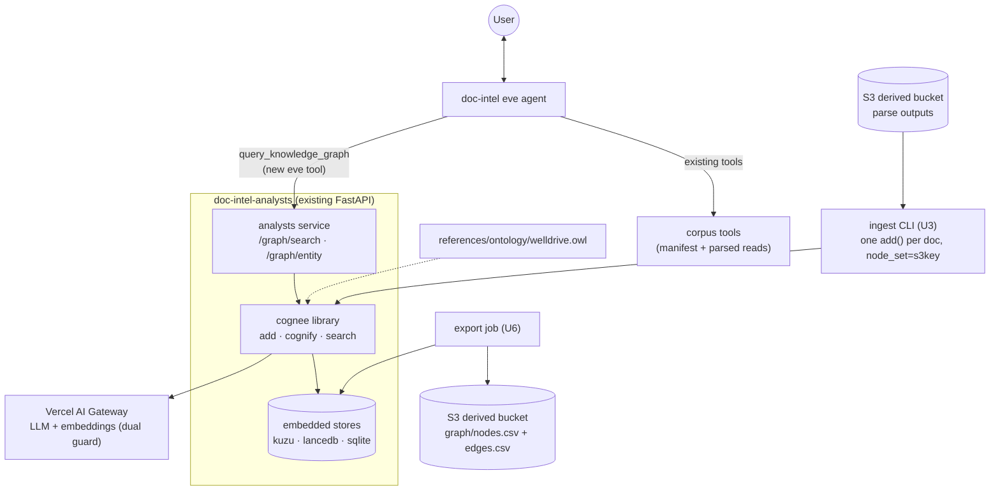

# doc-intel Memory Layer - Plan

## Goal Capsule

**Objective:** Give the eve-agents project a staged memory capability, starting with a corpus knowledge graph for doc-intel: Cognee (embedded in the analysts service) builds an entity graph from the parsed subset of the 500-file WellDrive sample — 311 documents carry parse output; 30 pilot rows have none — doc-intel queries it through a new eve tool, and the graph exports to open nodes/edges files from day one.

**Product authority:** Rob (Head of Technology). Direction confirmed 2026-07-05 after approach comparison: Cognee backbone + day-one portable export, over native-primitive assembly or warehouse-only tables.

**Open blockers:** none. Two human gates live inside the work itself, both owned by Rob: the U3 cognify cost checkpoint after the 20-document trial slice, and the U7 entity-quality go/no-go after full ingestion. Stop and surface rather than guess if either gate's evidence is ambiguous.

**Authority:** this plan's Product Contract (confirmed by Rob 2026-07-05) governs scope; repo house rules (CLAUDE.md) override implementation choices; user redirects override both.

## Product Contract

### Summary

Add a memory layer to doc-intel with Cognee — embedded as a library inside the analysts service — as the knowledge-graph backend. Stage 1 ingests the corpus sample's existing parse outputs, builds an ontology-guided entity graph (wells, vendors, formations, events), and exposes it to the eve agent through framework-native memory tools — proven when the corpus is explorable through conversation as entities rather than files. The graph is a portable data product: open-format node/edge exports land in the derived bucket as a stage-1 requirement.

### Problem Frame

doc-intel today has no memory of any kind: every session starts cold, the only persistence is the corpus parse cache, and knowledge extracted while answering one question evaporates before the next. The corpus itself is only navigable as 500 filenames plus entry_type metadata — nothing links the same well, vendor, or formation across documents. The long-term intent (confirmed in dialogue) is that this knowledge becomes a data product other systems consume — future eve agents, dbt/Snowflake models, dashboards — which makes the missing layer a graph, not a chat-history store.

### Key Decisions

- **Cognee is the knowledge-graph backend; alternatives were weighed and declined for stage 1.** Native-primitive assembly (deepagents Store + pgvector) offers KV+vector but no entities, relationships, or ontology — it would hand-roll the hard part. Warehouse-only tables cover just the tier-A extraction subset. Cognee does entity/relationship extraction with OWL ontology matching, ingests our already-parsed Markdown/JSON directly, runs with embedded storage defaults (no new external infra), and serves both the TypeScript and Python layers.
- **Interfaces framework-native, backends swappable, knowledge portable.** eve reaches memory only through eve-conventional tools (per eve's own memory pattern: tools + per-turn injection behind a trust boundary); the deepagents layer keeps its native memory slots for later stages. Cognee sits behind these interfaces as a replaceable backend — the same harness-is-disposable principle the repo is built on.
- **Portability is a stage-1 requirement, not a follow-up.** Node/edge exports in open tabular form (parquet or CSV) are part of the definition of done. This is what makes "other systems consume it" real and keeps the house rule (knowledge layer outlives any runtime) intact.
- **All Cognee LLM calls route through the Vercel AI Gateway** via its OpenAI-compatible custom-provider config. No new egress path for document content.
- **Staged roadmap, one slice now.** Stage 1 is the corpus graph only. Stage 2 (cross-session recall) and stage 3 (learned analyst expertise) are designed-for — reserved slots named below — but not built.

### Actors

- **doc-intel eve agent** — queries the graph to answer entity-shaped questions; the stage-1 proof surface.
- **Cognee (embedded library)** — runs inside the analysts service, not as a separate server; ingests parse outputs, builds and serves the graph.
- **deepagents analysts service** — hosts the embedded Cognee module and new `/graph` endpoints; its analyst SubAgents are unchanged in stage 1.
- **Downstream systems (future)** — dbt/Snowflake, dashboards, other eve agents; consume the exported node/edge files, not Cognee itself.
- **Rob** — judges the entity-quality gate and the cognify cost checkpoint.

### Requirements

**Graph construction**

- R1. Cognee ingests the corpus sample from existing parse outputs (pilot tiers and doc-intel cache) — no re-parsing of source documents and no raw-file re-upload.
- R2. Entity extraction is ontology-guided: an O&G ontology file (wells, operators/vendors, formations, document classes, key events) steers entity typing, seeded from the domain vocabulary already encoded in the corpus manifest and analyst-class table.
- R3. Ingestion runs as a resumable batch over the sample with per-document success/failure accounting, following the pilot-run reporting pattern.
- R4. A 20-document trial slice runs first and reports cognify token cost; the full 311-document run proceeds only after the cost checkpoint passes.

**Agent access**

- R5. The eve agent gains a graph-query tool (eve-conventional: one file, snake_case, Zod schema) that answers entity-shaped questions — everything about a well, connections between entities, documents mentioning an entity.
- R6. Graph answers carry two-tier provenance: every fact is traceable to its source document key (graph-level), and page-level attribution is recovered by re-reading the parsed document before citation; a fact that cannot be pinned to a page is dropped or re-verified per AE4, so citation discipline survives the new retrieval path.
- R7. When the graph cannot answer, the agent falls back to its existing manifest/document tools and says which path produced the answer.

**Portability**

- R8. The graph exports as open tabular node and edge files (parquet or CSV) to the derived bucket, refreshed at least per ingestion run.
- R9. The export shape is documented in the repo knowledge layer well enough that a dbt model could consume it without reading Cognee documentation.

**Guardrails**

- R10. All Cognee LLM and embedding calls route through the configured Vercel AI Gateway; document content reaches no other external service.
- R11. Credentials via environment only; nothing in code or committed config.
- R12. Stage-1 memory is single-tenant; no per-user scoping.

### Key Flows

- F1. **Ingest:** parse outputs (derived bucket) → Cognee add → cognify with ontology → graph persisted in Cognee's stores → nodes/edges exported to derived bucket → run report (counts, failures, cost).
- F2. **Query:** user asks entity-shaped question → eve agent calls graph-query tool → Cognee search (graph + vector) → agent verifies provenance via existing read tools where citations matter → answer organized by entities with citations.
- F3. **Fallback:** graph miss or Cognee unreachable → agent answers via existing corpus tools → notes that graph memory was unavailable/insufficient.

### Scope Boundaries

**In:** stage-1 graph over the parsed subset (311 documents) of the existing 500-file sample; ontology file; ingest batch + cost checkpoint; eve graph-query tool; open-format exports + documentation; quality-gate evaluation.

**Out (this stage):** stage 2 cross-session recall (reserved slot: Cognee memory or deepagents Store — decided when built); stage 3 learned analyst expertise (reserved slot: deepagents file memory in the knowledge layer); full-corpus ingestion (needs Rob's explicit call); any visual graph UI; multi-tenant scoping; the Snowflake/dbt load of the exports (export artifact in scope, warehouse side not); benchmark expansion.

### Acceptance Examples

- AE1. "Tell me everything we have on the Benbrook D federal wells" → answer organized by well entity: documents by class, key events, linked vendors/operators — with (key, page) citations, not a filename list.
- AE2. "Which wells share a frac vendor with Wrangler N731H?" → graph traversal produces wells + the connecting vendor entity, each edge grounded in cited documents.
- AE3. The analysts service (which hosts the embedded graph) is down → agent still answers from existing tools and states that graph memory was unavailable.
- AE4. A graph-surfaced fact whose provenance can't be verified on the cited page → agent treats it per citation discipline: drop it or re-read the source; never present it uncited.
- AE5. A dbt developer given only the exported files and their doc note can state well→document→vendor relationships without touching Cognee.

### Outstanding Questions

- OQ1. **Entity-quality bar.** Provisional gate: spot-check via agent Q&A on ~20 known entities across the three asset teams, judged by Rob. If rigor is wanted instead, a small entity-grounding benchmark (QA-benchmark style) replaces the spot-check — decide at planning.
- OQ2. **Cognify cost.** Unestimated until the R4 trial slice reports; checkpoint owner is Rob.
- OQ3. **Embedded vs Postgres backends at stage 1.** Embedded defaults (Kuzu/LanceDB/SQLite) are assumed for the sample scale; the Postgres-backed variant becomes relevant with the full corpus or warehouse-direct querying. Planning may pin this.

### Assumptions

- The 311 documents with parse output are sufficient graph seed. The remaining 189 sample rows (159 never parsed; 30 pilot rows with no usable output: 9 pilot-error, 15 pilot-failed, 6 pilot-skipped_tier) join via the existing parse-on-demand path opportunistically, not as a stage-1 gate — the ingest ledger classifies the 30 as "no parse output", never as failures.
- Single shared graph store (single-tenant); Cognee's per-user access control is explicitly disabled.
- Ontology is an agent-drafted artifact seeded from repo vocabulary, not a domain-expert review; Rob may request a review pause before ingestion (see U2).

---

## Planning Contract

**Product Contract preservation:** changed in four places, all review-driven corrections rather than scope changes — (1) the "Cognee service" actor is now the embedded library inside the analysts service per KTD1 (the TypeScript/REST Cognee assumption dissolved with it); (2) document counts corrected from 341 to 311 (R4, Assumptions, Scope) — 30 pilot rows carry no parse output, so the prior number made the Definition of Done unsatisfiable; (3) R6 now states the two-tier provenance mechanism honestly (document-level tags, page-level re-read) instead of implying tags carry pages; (4) confirmed by Rob via review-fix approval 2026-07-06.

### Key Technical Decisions

- **KTD1 — Embed Cognee as a library inside the existing analysts service.** `cognee` 1.2.2 is async-native (every API is `await`-able from FastAPI routes), pulls no torch, and ships arm64 wheels. The analysts service gains a `graph` module and `/graph/*` endpoints; eve talks to the same service it already trusts for `delegate_analysis`. No third runtime, no Cognee server, and the backend stays swappable behind our endpoints (fallback if embedding sours: Cognee's Docker server behind identical endpoints). Confirmed by Rob at scoping.
- **KTD2 — Explicit egress lockdown is a hard guard, not a convention.** Cognee routes LLM and embeddings independently; leaving either `LLM_*` or `EMBEDDING_*` unset silently defaults that path to api.openai.com — a house-rule breach (content egress outside the gateway). The graph module refuses to initialize unless both endpoint groups are explicitly set to the gateway **and** Cognee's usage telemetry is disabled (exact env var verified at U1 start); the guard test asserts all three, and U1 enumerates any other outbound call 1.2.2 makes so R10's "no other external service" is enforced, not assumed. (Source: docs.cognee.ai/setup-configuration/llm-providers; cognee issue #1500.)
- **KTD3 — Two-tier provenance: `node_set` tags carry the document key; pages come from re-reads.** Each document is added with `node_set=["s3key:<corpus key>"]` — the supported mechanism that survives into the graph and scopes searches (`node_name=[...]`). Tags are document-level only: page attribution is recovered at citation time by re-reading the parsed document (KTD7), and is best-effort for facts the graph synthesizes across chunks — an unpinnable fact is dropped or re-verified (AE4), never cited with a guessed page. One add per document also gives the per-document ledger R3 requires (Cognee has no per-item partial-success reporting on batch adds). Internal Cognee node ids are never used as our keys.
- **KTD4 — Embedded storage defaults with explicit roots; access control off.** Kuzu (graph) + LanceDB (vectors) + SQLite (relational), file-based under an explicit gitignored data directory (`DATA_ROOT_DIRECTORY`/`SYSTEM_ROOT_DIRECTORY` set — the library default lands venv-relative). `ENABLE_BACKEND_ACCESS_CONTROL` is explicitly disabled: it defaults ON in 1.2.2 and would silently shard storage per-user. Postgres/Neo4j backends are the documented full-corpus upgrade path, not stage-1.
- **KTD5 — Ontology is an open `.owl` (RDF/XML) file in the repo knowledge layer**, loaded via `RDFLibOntologyResolver`, seeded from vocabulary the repo already owns: entry_types (59 document classes), analyst classes, asset teams, and entity kinds (Well, Operator, ServiceVendor, Formation, County, Event — the Event class carries the "key events" R2 and AE1 promise). Knowledge-layer placement keeps it portable and reviewable (R2).
- **KTD6 — Exports are `nodes.csv` + `edges.csv` to the derived bucket.** Zero new dependencies, Snowflake-native ingestion, refreshed per ingest run (R8). Parquet is a documented upgrade, not built now. Primary extraction is the graph engine's `get_graph_data()` (import path flagged unverified at 1.2.2 — verify at U6 start); fallback on the same footing as the plan's other unverified bets: read the embedded Kuzu store directly via the `kuzu` Python API (Cypher over the store files). If neither yields usable node/edge data, R8/R9 are blocked — surface to Rob rather than shipping without exports.
- **KTD7 — Search mode `GRAPH_COMPLETION` with references; eve re-verifies citations.** Graph-grounded answers with the deterministic Evidence section; `CHUNKS` mode retrieves raw sources when the agent needs them. The eve tool inherits the `delegate_analysis` trust posture: graph-surfaced citations are re-verified via `read_parsed_document` before reaching the user (R6).
- **KTD8 — Model for cognify runs through `ANALYST_MODEL`-style env** (`GRAPH_MODEL`, default a mid-tier gateway model) so extraction cost is tunable without code changes, mirroring the analyst-classes model-override pattern.

### High-Level Technical Design

Prose is authoritative: the eve agent never talks to Cognee directly — only to the analysts service; the ingest CLI and export job are operator-invoked commands inside the analysts package, not agent tools.

---

## Implementation Units

### U1. Cognee integration module and config guard

**Goal:** the analysts service can initialize Cognee against the gateway and embedded stores, safely.
**Requirements:** R10, R11, R12 (foundation for all others)
**Dependencies:** none
**Files:** `agents/doc-intel/analysts/pyproject.toml` (add `cognee`, pinned `1.2.x`), `agents/doc-intel/analysts/src/doc_intel_analysts/graph/config.py`, `agents/doc-intel/analysts/src/doc_intel_analysts/graph/__init__.py`, `agents/doc-intel/analysts/tests/test_graph_config.py`
**Approach:** a config module that sets all Cognee env (LLM_*, EMBEDDING_*, telemetry-disable, storage providers, explicit DATA/SYSTEM root dirs under a gitignored `agents/doc-intel/analysts/.cognee/`, `ENABLE_BACKEND_ACCESS_CONTROL=false`) before first cognee import/use, and raises on missing gateway config for either path or telemetry left enabled (KTD2); at unit start, enumerate 1.2.2's outbound calls (telemetry env var name, any reranker/analytics) and close them. Async init happens lazily on first use, mirroring the existing `get_agent()` pattern — with one lifecycle rule: the module exposes an explicit dispose/release for the embedded Kuzu handle, because ingest (a separate process) cannot acquire the single-writer lock while the service holds the store open (see U3 and Risks).
**Patterns to follow:** `agent.py`'s `_gateway_model` env handling; lazy singleton in `service.py`.
**Test scenarios:** guard raises when EMBEDDING endpoint unset even with LLM set (and vice versa); guard raises when telemetry is not disabled; guard passes with all set; storage roots resolve under the package dir and are created; access-control env is set false. Use monkeypatched env; never call the network.
**Verification:** `uv run pytest` green; `uv run python -c "from doc_intel_analysts.graph import config"` importable without cognee side effects.

### U2. WellDrive ontology file

**Goal:** an open, reviewable O&G ontology steering entity typing (R2).
**Requirements:** R2
**Dependencies:** none (parallel with U1)
**Files:** `references/ontology/welldrive.owl`, `references/ontology/README.md`, `agents/doc-intel/analysts/tests/test_ontology.py`
**Approach:** OWL RDF/XML with classes (Well, Operator, ServiceVendor, Formation, County, AssetTeam, Event, plus a DocumentClass hierarchy from the 59 entry_types grouped by the 7 analyst classes), key object properties with domain/range (operatedBy, servicedBy, locatedIn, penetrates, documentedBy, occurredOn — Event covers dated operational occurrences such as tests, jobs, and workovers). Seeded mechanically from `corpus/sample-manifest.csv` + `references/analyst-classes.json` vocabulary; hand-shaped, ~150 lines, not exhaustive.
**Execution note:** offer Rob a review pause when the file first lands, before U3 consumes it — his call per the scoping synthesis.
**Test scenarios:** rdflib parses the file; expected core classes and properties are present; every analyst class maps to at least one DocumentClass.
**Verification:** pytest green; file renders in any RDF tool.

### U3. Ingest CLI with ledger and cost checkpoint

**Goal:** parsed corpus content becomes graph content, accountably (R1, R3, R4).
**Requirements:** R1, R3, R4
**Dependencies:** U1, U2
**Files:** `agents/doc-intel/analysts/src/doc_intel_analysts/graph/ingest.py`, `agents/doc-intel/analysts/tests/test_ingest.py`
**Approach:** CLI (`uv run python -m doc_intel_analysts.graph.ingest --limit 20`) iterating the 311 manifest rows with parse output, reusing `corpus.fetch_document` for reads; per document, serialize by view kind — `markdown` flattens pages with page markers preserved; `extraction` serializes `extraction.fields` + `field_pages` to text (the 53 tier-A documents otherwise ingest as empty) — then `cognee.add(text, dataset_name="welldrive", node_set=["s3key:<key>"])` with per-doc exception capture; then one `cognify` with the ontology resolver. Rows without parse output (30 pilot-error/failed/skipped_tier) are ledgered as `no-parse-output`, not failures. Ledger CSV (key, status, kind, chars, duration, error) written per run to the derived bucket next to the graph exports, pilot-run style. Resumable for `add()`: skip keys already OK in prior ledgers. **cognify semantics are verify-at-unit-start:** determine whether 1.2.2's cognify is incremental/idempotent over already-added data; if it is not checkpointable, document that a partway cognify failure re-incurs the full graph-building cost — the "resumable" claim is scoped to ingestion, and the trial-slice report must say so. **Process lifecycle:** the analysts service must be stopped (not merely idle — lazy init holds the Kuzu handle) during ingest, and restarted/reloaded after, before graph queries are trusted; stage-1 operational constraint, stated in the runbook output of the CLI.
**Execution note:** the 20-doc trial slice is sampled across document sizes and classes from all three asset teams (not the first 20 rows); report cost as a per-document rate with the explicit caveat that cognify's cross-document entity resolution may scale superlinearly, so the checkpoint judges a range, not a flat ×16. STOP for Rob's checkpoint before the full run (hard gate — do not proceed on ambiguity).
**Test scenarios:** ledger records a failure and continues when one document's fetch raises; a no-parse-output row ledgers as `no-parse-output`, not failure; an extraction-kind view produces non-empty ingest text containing its field values; already-ingested keys are skipped on resume; page flattening preserves page markers; node_set tag formats as `s3key:<exact key>`; trial-slice sampler spans all three asset teams. Cognee calls stubbed throughout.
**Verification:** pytest green; trial-slice run produces a ledger with 20 rows, a per-doc cost rate, and the cognify-restart semantics documented — all surfaced to Rob.

### U4. Graph endpoints on the analysts service

**Goal:** one HTTP surface for graph queries, translating Cognee results into our provenance vocabulary.
**Requirements:** R5 (service half), R6
**Dependencies:** U1; content usefulness depends on U3 having run
**Files:** `agents/doc-intel/analysts/src/doc_intel_analysts/graph/api.py`, `agents/doc-intel/analysts/src/doc_intel_analysts/service.py` (mount router), `agents/doc-intel/analysts/tests/test_graph_api.py`
**Approach:** `POST /graph/search` ({question, entity_scope?, mode}) → cognee search (GRAPH_COMPLETION default, CHUNKS for raw) → response {answer, sources: [{key}], mode}; source keys recovered from `s3key:` node_set tags (pure translation function, unit-tested). `GET /graph/health` reports store presence + document count. Verify the flagged chunk→document link field against installed 1.2.2 at unit start; if tag recovery proves unreliable in GRAPH_COMPLETION mode, fall back to returning CHUNKS-derived sources alongside the answer.
**Patterns to follow:** `/analyze` endpoint shape, pydantic models, JSON-to-stdout logging.
**Test scenarios:** tag→key translation handles keys containing `__`, commas, spaces; malformed cognee results yield a clean 502-style error not a crash; entity_scope maps to node_name filtering; health endpoint with empty store reports zero without erroring. Cognee stubbed.
**Verification:** pytest green; live smoke against the ingested trial slice returns a grounded answer with at least one real source key.

### U5. eve tool `query_knowledge_graph` + agent guidance

**Goal:** the corpus becomes explorable through the agent (R5, R7 — the stage-1 proof surface).
**Requirements:** R5, R6, R7
**Dependencies:** U4
**Files:** `agents/doc-intel/agent/tools/query_knowledge_graph.ts`, `agents/doc-intel/tests/query_knowledge_graph.test.ts`, `agents/doc-intel/agent/instructions.md` (when-to-use guidance), `agents/doc-intel/agent/skills/triage.md` (graph-first note for entity-shaped questions)
**Approach:** mirror `delegate_analysis` exactly: Zod schemas both directions, `DOC_INTEL_ANALYSTS_URL` base, graceful unreachable/malformed handling, and a response reminder that graph citations must be verified with `read_parsed_document` before presentation (KTD7). Instructions tell the agent: entity-shaped questions go graph-first; state which path (graph vs manifest) produced the answer; fall back per R7.
**Test scenarios:** happy path returns answer + source keys (stubbed fetch); unreachable service returns the R7 fallback error text; malformed response rejected by schema; request carries the question and scope only (no document bodies).
**Verification:** `pnpm typecheck`, `pnpm test`, `npx eve info` 0 diagnostics with the tool discovered, headless boot check.

### U6. Graph export to open files + consumer doc

**Goal:** the graph is a portable data product (R8, R9).
**Requirements:** R8, R9
**Dependencies:** U3
**Files:** `agents/doc-intel/analysts/src/doc_intel_analysts/graph/export.py`, `agents/doc-intel/analysts/tests/test_export.py`, `references/graph-export.md`
**Approach:** CLI (`... -m doc_intel_analysts.graph.export`) pulling `get_graph_data()` from the graph engine (verify import path at unit start — flagged unverified; **fallback:** read the embedded Kuzu store directly with the `kuzu` Python API/Cypher; if neither yields node/edge data, surface the R8/R9 blockage to Rob — per KTD6), serializing to `nodes.csv` (id, type, name, properties-json) and `edges.csv` (source, target, label, properties-json), uploading to `s3://formentera-welldrive-derived/runs/doc-intel/graph/`. `references/graph-export.md` documents the schema + a worked "join wells to vendors" example for a dbt reader (R9 acceptance: AE5). Invoked at the end of each ingest run.
**Test scenarios:** serializer escapes embedded commas/quotes/newlines in entity names (WellDrive names guarantee these); properties round-trip as JSON; empty graph exports headers-only files without erroring. S3 + engine stubbed.
**Verification:** pytest green; post-ingest run leaves both CSVs in the bucket; the doc's worked example matches real exported rows.

### U7. Quality gate and live eval

**Goal:** stage-1 success is judged, not assumed (OQ1 resolution; AE1/AE2).
**Requirements:** R5, R6; Product Contract success proof
**Dependencies:** U3 (full run), U5
**Files:** `agents/doc-intel/evals/graph-explore.eval.ts`, `benchmark/results/` (gate results archive), spot-check list as `docs/plans/` sibling note or benchmark file
**Approach:** (a) eve eval in the delegation-eval style: an AE1-shaped question (all documents/events for a named well) asserting `query_knowledge_graph` was called, the reply is entity-organized, and cites at least one correct source key — requires live services + gateway, outside the credential-free bar like `delegation.eval.ts`; (b) the human gate: ~20 known entities sampled across the three asset teams (from manifest ground truth), asked through the agent, judged by Rob; results archived like benchmark runs.
**Execution note:** the gate verdict is Rob's; archive the verdict either way, and treat a failed gate as scope-complete-but-unproven — surface, don't iterate unprompted into re-ingestion loops.
**Test scenarios (eval gates):** tool called; answer names the well entity; at least one cited key belongs to that well in the manifest.
**Verification:** eval passes 4/4-style gates against live services; gate verdict archived.

---

## Verification Contract

From `agents/doc-intel/` unless noted:

- `pnpm typecheck` and `pnpm test` — zero errors, all unit tests green (TS side).
- `cd analysts && uv run pytest tests/ -q` — all green (Python side).
- `npx eve info` — 0 errors, 0 warnings; `query_knowledge_graph` discovered.
- Boot check: `npx eve dev --no-ui` reaches "listening"; analysts service `/health` and `/graph/health` return ok.
- Existing regression floor: `npx eve eval delegation --url <dev-url>` still 4/4 — the graph work must not disturb the delegate_analysis path.
- New: `npx eve eval graph-explore --url <dev-url>` passes against ingested stores (requires gateway credentials + both services; documented as outside the credential-free bar).
- Human gates (both Rob-owned, both blocking): U3 cost checkpoint after the 20-doc trial; U7 entity-quality verdict after full ingestion.
- House rule: dedicated sub-agent audit of the diff before any PR (repo standing rule; secrets scan, egress check — KTD2 guard test must be shown green in the audit).

## Definition of Done

- All seven units landed on feature branch(es) through audited PR(s); main green on the full Verification Contract.
- All 311 parse-carrying documents ingested with a ledger (failures accounted, the 30 no-parse-output rows classified as such, not hidden); cost checkpoint passed and recorded.
- `nodes.csv`/`edges.csv` present in the derived bucket with `references/graph-export.md` documenting them (AE5-capable).
- `graph-explore` eval green; delegation eval still green; Rob's spot-check verdict archived (pass, or a surfaced no-go decision).
- Agent instructions updated so graph-first routing is discoverable by a cold session.
- No abandoned experiments left in the diff; `.cognee/` data directories gitignored; no secrets or non-gateway egress introduced.

## Risks & Dependencies

- **Entity resolution on messy well names** (the fatal risk): duplicate nodes for one well would make the graph noise. Ontology fuzzy matching + node_set tagging mitigate; the U7 gate judges; a failed gate stops before anything consumes bad data.
- **Cognify cost unknown** until the trial slice; hard human checkpoint (R4) bounds exposure.
- **Cognee 1.2.2 API youth:** four details flagged unverified by research (graph-engine export import path; chunk→document link field; cognify incrementality; telemetry env var name) — pinned to verify-at-unit-start in U1/U3/U4/U6, each with a named fallback or documented degradation; dependency pinned to 1.2.x.
- **Embedded Kuzu is single-writer and process-holds its lock:** an "idle" service that has lazily opened the store still blocks the ingest writer, and a long-lived service is not guaranteed to see post-ingest data without reopening. Stage-1 operational rule (U1/U3): stop the service during ingest, restart/reload it after, keep uvicorn single-worker. Postgres/Neo4j is the concurrency upgrade path.
- **Silent OpenAI default** (KTD2) — guarded and tested; the pre-PR audit re-checks.

## Sources & Research

- Cognee 1.2.2 API/config/provenance facts: docs.cognee.ai (search-basics, llm-providers, ontology-support), github.com/topoteretes/cognee (.env.template, skill.md, issue #1500, issue #3691 — no-torch confirmation), PyPI cognee. Two flagged-unverified items noted in Risks.
- Memory landscape (Cognee vs LangGraph Store vs Vercel-native): session research 2026-07-05 — Vercel confirmed to offer no native memory product; deepagents Store reserved for stage 2.
- eve memory pattern (tools + injection + trust boundary, not defineState): `agents/doc-intel/node_modules/eve/docs/patterns/multi-tenant-memory.md`.
- Existing patterns to mirror: `agents/doc-intel/agent/tools/delegate_analysis.ts` (tool shape, trust posture), `agents/doc-intel/analysts/src/doc_intel_analysts/corpus.py` (S3 reads, manifest binding), `agents/doc-intel/evals/delegation.eval.ts` (live eval shape), June pilot ledger (`s3://formentera-welldrive-derived/runs/pilot/results.csv`) for the ingest report shape.
