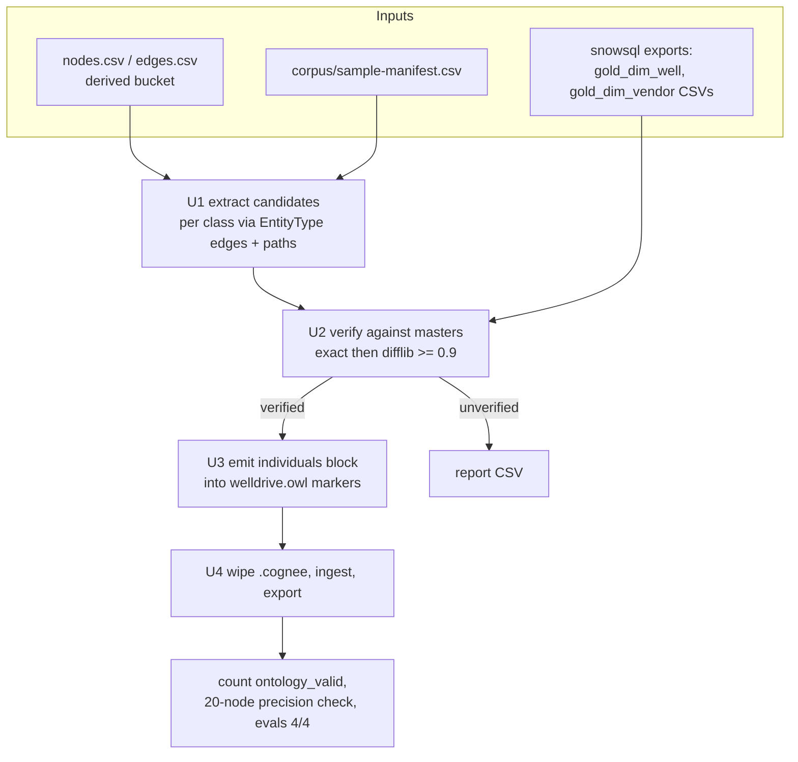

# Ontology Individuals Enrichment - Plan

## Goal Capsule

- **Objective:** Raise the doc-intel knowledge graph's ontology match rate from 12/4,720 extracted entities by adding corpus-scoped named individuals to `references/ontology/welldrive.owl` via a deterministic generator, then rebuilding the graph.
- **Product authority:** Rob (dialogue, 2026-07-06). Source strategy, scope, success bar, snowsql-CLI access pattern, and dev-schema verification source confirmed.
- **Open blockers:** None. PR #7 (learnings docs) is unrelated and can merge independently.
- **Stop conditions:** Stop and surface if the first enriched rebuild lands under 400 valid or under 90% precision after one iteration of the KTD7 protocol, if snowsql cannot reach the master models, or if cognify wall-clock degrades materially (>2× the ~35-minute baseline).

---

## Product Contract

Product Contract unchanged from the 2026-07-06 brainstorm.

### Summary

Build a deterministic generator that writes the named-individuals section of `references/ontology/welldrive.owl` from corpus-seen entity names verified against Snowflake masters, then rebuild the knowledge graph and verify ontology-valid entities rise to at least 400 with a passing precision spot-check.

### Problem Frame

The typed graph rebuild (2026-07-06) attached ontology metadata to all 6,856 nodes, but only 12 of the 4,720 extracted entities carry `ontology_valid=true`. The cause is structural: cognee's `RDFLibOntologyResolver` fuzzy-matches extracted entity *names* against ontology *individuals* at an 80% similarity cutoff, and `welldrive.owl` is class-only — it defines Well, Operator, ServiceVendor, County, AssetTeam, and the DocumentClass hierarchy, but names almost no individuals. Without named individuals there is nothing for extracted entities like "scientific drilling" or "neal 3h st02" to match, so the typed-node guarantees that downstream CSV consumers rely on (e.g., `type = 'ServiceVendor'` joins per `references/graph-export.md`) cover almost nothing.

The dlt-pipelines ontology Rob derived (`.schema/formentera/ontology.md`, 66 entities / 146 edges) was the intended source to borrow from, but it is also class-level — it contains no named individuals. What it contributes instead is the measured identity spine into the Snowflake masters where the real names live, and the generator convention (`tools/build_ontology.py`: deterministic script, no hand edits to outputs).

### Key Decisions

- **Corpus-scoped individuals, not enterprise-wide.** Individual lists are bounded to what the WellDrive corpus sample can plausibly mention: wells in the sample's asset teams, vendors/operators seen in the graph exports, TX/NM counties, all asset teams, all operating companies. Wider lists (the 56K business-entity master) slow cognify and generate false-positive matches at the 80% fuzzy cutoff.
- **Corpus-derived spellings are the primary individuals; Snowflake masters verify.** The fuzzy matcher sees names as documents spell them, so individuals use corpus-extracted spellings (graph exports + manifest paths) for maximum match rate. Snowflake masters — reached via the identity spine mapped in dlt-pipelines — confirm each individual is a real enterprise entity, which breaks the circularity of validating extraction purely against its own output.
- **Generated OWL, never hand-edited.** A deterministic script regenerates the individuals whenever the corpus or masters change, mirroring the dlt-pipelines `build_ontology.py` convention. The generator lives in eve-agents; dlt-pipelines is a read-only reference (no cross-project imports, per workspace rules).
- **Wells join the individuals classes.** Beyond the originally pinned four (operators, vendors, asset teams, counties), Well individuals are included: well names come directly from corpus manifest paths in document spelling and are expected to drive most of the match count.

### Requirements

**Generator**

- R1. A deterministic generator script in eve-agents regenerates the named-individuals content of `references/ontology/welldrive.owl`; re-running it on unchanged inputs produces identical output, and the file carries a do-not-hand-edit marker.
- R2. Generator inputs are the graph exports (`runs/doc-intel/graph/nodes.csv` in the derived bucket), the corpus manifest (`corpus/sample-manifest.csv`), and Snowflake master tables for verification. Snowflake access happens only at generation time on the operator's machine; the deployed agent and analysts service gain no new runtime dependency.
- R3. Individuals are typed to the existing OWL classes — Well, Operator, ServiceVendor, County, AssetTeam — with no restructuring of the class or relationship layer. Each individual carries its verification provenance (which master confirmed it).
- R4. Candidate names that cannot be verified against a master are excluded from the OWL, and the generator reports them so misses are visible rather than silent.

**Rebuild and verification**

- R5. After enrichment, the graph is rebuilt clean per the established procedure: analysts service stopped, local cognee store wiped, full ingest re-run, exports auto-refreshed.
- R6. The existing rdflib parse tests and ontology-path guard tests stay green against the enriched OWL.
- R7. Both evals (`graph-explore`, `delegation`) pass 4/4 against the rebuilt graph.

### Success Criteria

- `ontology_valid=true` entities rise from 12 to at least 400 (≥30× baseline) out of ~4,720 extracted entities.
- A 20-node spot-check of validated entities shows ≥90% are correct matches — the matched individual genuinely is the entity the document mentioned, not an 80%-cutoff near-miss.
- Both evals stay 4/4 (R7); a failed precision check or eval regression means iterating on the individual lists, not shipping.

### Scope Boundaries

- Enterprise-wide individual lists (full 56K business-entity master, all ~6,900 Peloton wells) — deferred until full-corpus (111k) expansion needs them.
- No changes to the OWL class/relationship structure, the cognee configuration, or the ingest pipeline beyond the ontology file itself.
- No changes in the dlt-pipelines repo; its ontology artifacts are read-only inputs.
- Formation individuals are not required for the success bar; planning may include them opportunistically if a bounded list falls out of the same sources.

### Dependencies / Assumptions

- Snowflake masters are reachable at generation time (the identity spine measured in dlt-pipelines: ODA BusinessEntity/entity codes, Peloton well master keyed by WELLIDA/API10).
- The graph exports from the 2026-07-06 typed rebuild are current and contain extractor-spelled Operator/ServiceVendor/Well names (verified: 4,720 Entity nodes, 3,970 distinct names).
- Assumption: corpus-scoped lists land in the hundreds of individuals, small enough not to degrade cognify wall-clock materially. If the count balloons, revisit scope before ingesting.
- Assumption: entity names (wells, vendors, counties, teams) are not sensitive content — the OWL stays in the open knowledge layer at repo root. Document *content* still only leaves infrastructure via the AI Gateway.

### Sources

- `references/ontology/welldrive.owl` — current class-only ontology (243 triples).
- dlt-pipelines repo: `.schema/formentera/ontology.md` (identity spine + 66-entity graph), `tools/build_ontology.py` (deterministic-generator convention), `.schema/formentera/taxonomy.json`.
- Graph exports: `s3://formentera-welldrive-derived/runs/doc-intel/graph/nodes.csv|edges.csv` (refreshed 2026-07-06; schema in `references/graph-export.md`).
- Baseline measurements: 12/4,720 entities ontology_valid at cognee's 80% fuzzy cutoff; node-type census run 2026-07-06.
- Ground-truth well list: `benchmark/results/2026-07-06-u7-spot-check-list.md` (20 wells, reusable for the precision spot-check).

---

## Planning Contract

### Key Technical Decisions

- **KTD1 — Generator lives in the analysts package as an offline CLI.** `doc_intel_analysts/graph/individuals.py`, invoked as `uv run python -m doc_intel_analysts.graph.individuals` from `agents/doc-intel/analysts/`, mirroring `graph.export`. Zero new dependencies: boto3 is already a package dependency and rdflib arrives transitively via cognee. The module is never imported by `api.py` or the service runtime — it is tooling, like `graph.export` and `graph.ingest`.
- **KTD2 — Individuals are minted in cognee's matcher-normalized form.** Reading cognee 1.2.2 source (`cognee/modules/ontology/rdf_xml/RDFLibOntologyResolver.py`) settled the matching surface: the lookup key is the URI local name (`_uri_to_key`: fragment after `#`, lowercased, spaces→underscores), matched exact-first then `difflib.get_close_matches` at 0.8; `rdfs:label` is never consulted. Therefore each individual's URI fragment IS the match key: mint fragments already lowercased with underscores (e.g., `#scientific_drilling` typed `#ServiceVendor`). A spelling variant worth matching is a separate individual; `rdfs:label` may carry the display name for human readers but is non-functional.
- **KTD3 — Snowflake reached via snowsql CLI exports, not a connector dependency.** Committed `.sql` export queries produce local master-name CSVs (gitignored); the generator consumes those CSVs. The dbt schema holding the gold models is a CLI flag/env input defaulting to the current dev build (`FO_RAW_DB.dev_dbt_rob_stover`), since promotion may move them. This keeps the generator fully unit-testable with CSV fixtures and adds no Python dependency.
- **KTD4 — Verification sources per class.** Wells, counties, and operators/companies verify against `gold_dim_well` (grain: one row per EID, ~8K wells; golden-record well name, company, state/county). Vendors verify against `gold_dim_vendor` (one row per vendor). Asset teams need no Snowflake source — they are the corpus manifest's top-level path segments, a closed set. Unverified candidates are excluded and written to a report CSV (R4).
- **KTD5 — Individuals regenerate between markers; the class layer is untouchable.** The generator rewrites only a marked block (`<!-- BEGIN/END GENERATED INDIVIDUALS -->`) inside `welldrive.owl`, emitting individuals sorted by class then name for stable diffs. The hand-authored class/relationship layer above the markers is preserved byte-for-byte.
- **KTD6 — Conservative candidate→master matching.** The generator's own verification matching is stricter than cognee's: normalized exact match first, then `difflib` ratio ≥ 0.9 with a report column showing which master row matched and at what score. Cognee's 0.8 runtime cutoff is not touched — precision is controlled by what enters the OWL, not by loosening or tightening cognee.
- **KTD7 — Iteration protocol if the bar is missed.** First knob: add doc-side spelling variants (from graph-export names) as additional individuals for masters already verified. Second knob: widen per-class candidate sources (e.g., all wells in the sample's asset teams from `gold_dim_well`, not just manifest-named ones). Never lower cognee's cutoff and never admit unverified names.

### High-Level Technical Design

### Assumptions and Deferred Implementation Notes

- Exact column names in `gold_dim_well` / `gold_dim_vendor` are confirmed when writing the export SQL (U2); the governance catalog documents grain and content but not column lists.
- URI-fragment character handling for names containing `/`, `'`, or `&` is settled at implementation with the U3 normalization property test as the arbiter: whatever fragment is minted must round-trip through cognee's `_uri_to_key` back to the intended match key.
- The `ontology_valid` count is measured from node properties in the refreshed export, the same way the 12-node baseline was measured; if the typed rebuild changed where the flag lives, U4 adjusts the measurement, not the bar.

---

## Implementation Units

### U1. Candidate extraction from corpus artifacts

- **Goal:** Produce per-class candidate name lists (Well, Operator, ServiceVendor, County, AssetTeam) from the graph exports and corpus manifest.
- **Requirements:** R1, R2 (input side), Key Decision "corpus-derived spellings".
- **Dependencies:** None.
- **Files:** `agents/doc-intel/analysts/src/doc_intel_analysts/graph/individuals.py` (new), `agents/doc-intel/analysts/tests/test_individuals.py` (new).
- **Approach:** Pure functions over CSV inputs. Wells: manifest path segments (well directory names) plus export entities whose `is_a` edge targets a well-like EntityType (`well`, `oilwell`, `wellbore`). Operators/ServiceVendors: entities typed `organization`. Counties: entities typed `location` filtered to county-shaped names plus the county column of the well master (joined in U2). AssetTeams: manifest top-level path segments. Normalize every candidate with the same function that mints fragments (lowercase, spaces→underscores, whitespace collapse). Accept local paths for exports with an S3 fallback via the existing boto3 client pattern in `graph/export.py`.
- **Patterns to follow:** `graph/export.py` for CSV/S3 handling and CLI shape; `corpus.py` manifest parsing (`/\r?\n/`-safe reading is the committed convention — the manifest is CRLF).
- **Test scenarios:**
  - Happy path: fixture nodes/edges CSVs with two organizations, one well entity, one location → correct per-class candidate sets.
  - Manifest parsing: CRLF fixture manifest yields well names and asset teams from path segments; no empty candidates.
  - Edge case: entity with no `is_a` edge is ignored; duplicate names across documents dedupe to one candidate.
  - Edge case: names with `/`, apostrophes, and hyphens survive normalization and dedupe correctly (e.g., `BENBROOK UNIT 'D' FED 3H`).
- **Verification:** `uv run pytest tests/test_individuals.py` green from `agents/doc-intel/analysts/`.

### U2. Master verification against snowsql exports

- **Goal:** Split candidates into verified (with provenance) and unverified (reported), using master-name CSVs exported from Snowflake.
- **Requirements:** R2, R3 (provenance), R4.
- **Dependencies:** U1.
- **Files:** `agents/doc-intel/analysts/src/doc_intel_analysts/graph/individuals.py` (extend), `references/ontology/masters/gold_dim_well.sql` (new), `references/ontology/masters/gold_dim_vendor.sql` (new), `agents/doc-intel/.gitignore` (modify — ignore `analysts/.masters/`), `agents/doc-intel/analysts/tests/test_individuals.py` (extend).
- **Approach:** Committed `.sql` files select the name/county/company columns; the operator runs them via snowsql to produce local CSVs under `agents/doc-intel/analysts/.masters/`, which this unit adds to the gitignore along with the unverified report (written to the same directory) — the DoD's "gitignored" promise is delivered here, not assumed. The dbt schema is parameterized (CLI flag `--masters-schema`, default the current dev build). Matching per KTD6: normalized exact, else `difflib` ratio ≥ 0.9; ties resolve to the highest ratio. Output: verified list carrying `(name, class, master_source, master_key, score)` — `master_key` is working data for the report only and never enters the committed OWL (see U3). County candidates additionally admit the well master's county values directly (they are authoritative, bounded, and corpus-relevant by construction).
- **Patterns to follow:** dlt-pipelines `tools/snowflake/*.sql` convention for committed operator-run SQL.
- **Test scenarios:**
  - Happy path: candidate "scientific drilling" vs master "SCIENTIFIC DRILLING INTL" fixture → verified at ≥ 0.9 with score recorded, or unverified if below — assert the actual behavior chosen by the threshold.
  - Exact-after-normalization match short-circuits fuzzy (case/space differences only).
  - Unverified candidate lands in the report with its best score and nearest master name.
  - Missing masters CSV → loud `FileNotFoundError` naming the snowsql step (mirrors the fail-loud ontology-path guard convention).
- **Verification:** pytest green; running the CLI against real exports on the operator's machine produces a non-empty verified list and a report; `git status --porcelain` shows no untracked master CSVs or report after a generation run.

### U3. OWL emission and regeneration CLI

- **Goal:** Rewrite the marked individuals block of `references/ontology/welldrive.owl` deterministically from the verified list.
- **Requirements:** R1, R3, R6.
- **Dependencies:** U1, U2.
- **Files:** `references/ontology/welldrive.owl` (modify — add markers + generated block), `references/ontology/README.md` (modify — regeneration procedure), `agents/doc-intel/analysts/src/doc_intel_analysts/graph/individuals.py` (extend — emit stage + `__main__` CLI), `agents/doc-intel/analysts/tests/test_individuals.py` (extend), `agents/doc-intel/analysts/tests/test_ontology.py` (extend).
- **Approach:** Emit one `rdf:Description` per verified individual: `rdf:about="#<normalized-fragment>"`, `rdf:type` the existing class, `rdfs:label` the original spelling, and an annotation naming only the master source table (e.g. `gold_dim_vendor`) as provenance (R3) — raw `master_key` values stay in the gitignored verification report and never enter the committed file, since the names-only sensitivity assessment does not cover internal master keys. Sort by class then fragment. Splice between `BEGIN/END GENERATED INDIVIDUALS` markers, preserving everything outside byte-for-byte; refuse to run if markers are missing or duplicated. Reimplement `_uri_to_key` normalization in the test suite as the round-trip arbiter rather than importing cognee internals.
- **Technical design (directional):** the emitted fragment must satisfy `_uri_to_key(URIRef(base + "#" + fragment)) == normalize(original_spelling)` — this single property test pins KTD2 against cognee upgrades.
- **Test scenarios:**
  - Determinism: emitting the same verified list twice yields identical bytes (R1).
  - Round-trip property: for spellings with spaces, apostrophes, hyphens, and a `/`, minted fragment equals the matcher key after `_uri_to_key`-equivalent extraction.
  - Class layer preserved: bytes outside markers identical before/after regeneration; rdflib parses the result; class count unchanged; individuals counted as subjects typed to declared classes match the verified list length.
  - Guard: missing markers raise before any write.
  - `test_ontology.py`: rescope the entry-type label-count test to count only `rdfs:label` triples on `DocumentClass` subclasses (generated individuals also carry labels, which would otherwise inflate the count and fail the test); the remaining tests stay green unchanged.
- **Verification:** pytest green from `agents/doc-intel/analysts/`; `git diff references/ontology/welldrive.owl` shows only the generated block changing on re-runs.

### U4. Rebuild, measure, and gate

- **Goal:** Rebuild the graph on the enriched ontology and verify the success bar.
- **Requirements:** R5, R7; Success Criteria.
- **Dependencies:** U3.
- **Files:** `benchmark/results/` (new results note), `references/graph-export.md` (update if node `type` now carries ontology classes), `agents/doc-intel/analysts/.cognee/` (wiped, regenerated — untracked).
- **Approach:** Established procedure: stop the analysts service (Kuzu single-writer), remove the local store, run `uv run python -m doc_intel_analysts.graph.ingest` with `VERCEL_OIDC_TOKEN` exported from `agents/doc-intel/analysts/`; export auto-runs post-cognify. Measure `ontology_valid=true` count from the refreshed nodes export. Precision spot-check: sample 20 validated entities stratified across classes, confirm each matched individual is the entity the source document mentions (manifest keys via provenance tags), seeded from `benchmark/results/2026-07-06-u7-spot-check-list.md` for wells. Run both evals with the service and gateway creds up. Apply KTD7 iteration knobs at most once before stopping per the Goal Capsule stop conditions. Record counts, precision, eval results, and cost in a dated results note.
- **Execution note:** This unit is operational proof, not new code; prefer runtime evidence (counts, spot-check table, eval output) over unit coverage.
- **Test scenarios:** Test expectation: none — operational verification unit; evidence is the measured bar (≥400 valid, ≥90% precision, evals 4/4) recorded in the results note.
- **Verification:** Results note committed showing the bar met; `runs/doc-intel/graph/` exports refreshed; both evals 4/4.

---

## Verification Contract

| Gate | Command (from) | Applies to | Done signal |
|---|---|---|---|
| Python unit tests | `uv run pytest` (`agents/doc-intel/analysts/`) | U1–U3 | All pass, including new `test_individuals.py` and extended `test_ontology.py` |
| Workspace bar | `pnpm typecheck && pnpm test` (repo root) | all units | Green (TS untouched but the bar always runs) |
| Boot check | `npx eve dev --no-ui` (`agents/doc-intel/`) | U4 | `[DEV] server listening at` then clean kill |
| Graph rebuild | `uv run python -m doc_intel_analysts.graph.ingest` (`agents/doc-intel/analysts/`, service stopped, `VERCEL_OIDC_TOKEN` exported) | U4 | Ingest ledger complete; exports uploaded |
| Success bar | measured from refreshed `nodes.csv` + spot-check + `npx eve eval` | U4 | ≥400 ontology_valid; ≥90% precision on 20-node check; both evals 4/4 |

---

## Definition of Done

- Generator committed (U1–U3) with all listed tests green; `welldrive.owl` regenerated with verified individuals and the do-not-hand-edit marker; export SQL committed; masters CSVs and unverified report gitignored.
- Graph rebuilt on the enriched ontology; success bar met and recorded in a dated `benchmark/results/` note (≥400 valid, ≥90% precision, evals 4/4).
- `references/ontology/README.md` documents the regeneration procedure end-to-end (snowsql export → generator → rebuild).
- No dead-end or experimental code in the diff; work lands as conventional commits on a feature branch, pushed, with a PR opened after the pre-PR audit sub-agent reviews the diff.
