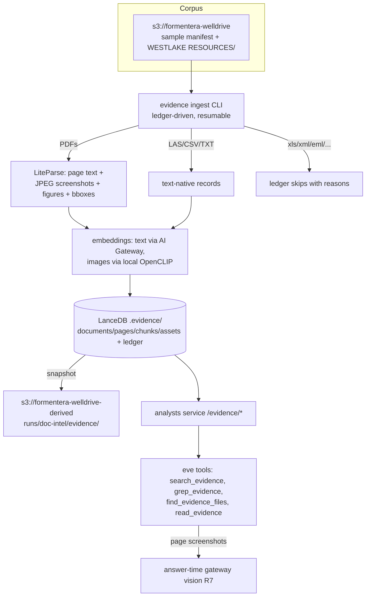

# Evidence Store - Plan

## Goal Capsule

- **Objective:** Give doc-intel its third retrieval leg — a self-hosted, page-keyed multimodal evidence store over the corpus sample plus the full Westlake Resources tranche, exposed to the agent as harness-shaped search tools, gated by a two-layer retrieval/answer bar.
- **Product authority:** Rob (dialogue, 2026-07-06). Corpus scope, success bar, escalation deferral, storage shape, and graph-leg non-interference all confirmed.
- **Open blockers:** None. Dependency approvals (see Dependencies) are consented in principle; formal sign-off happens at planning.

---

## Product Contract

Product Contract preserved from the 2026-07-06 brainstorm; one factual refresh — the Westlake tranche size assumption was replaced with the measured composition (37,434 objects / 25.3 GB), which adds a disk dimension to R10's checkpoint. No R-ID semantics changed.

### Summary

Build a local evidence store: LiteParse parses corpus documents into page-keyed layers (page text, page screenshots, extracted figures), stored with text and image embeddings in an application-owned LanceDB database, retrieved through a hybrid bundle that merges chunk, page, and figure searches by page identity, and exposed to the eve agent as semantic search, grep, find, and read tools. Versioned snapshots publish to the derived bucket.

### Problem Frame

doc-intel has two retrieval modalities: manifest/metadata navigation (structural questions) and the knowledge graph (entity questions over the 311 ingested docs). Neither answers content questions — "which pages discuss stuck pipe near 9,800 ft" has no good path, and the text-only parse tiers never see the visual evidence (log plots, survey charts, stimulation figures) that well files are dense with. cognee's CHUNKS search covers text for only the 311 graph-ingested documents. This gap is also what breaks first at full-corpus scale.

The 2026-07-06 research session (LlamaIndex's Retrieval Harness / Document Context Layer talk, and the LiteParse + LanceDB reference implementation `lancedb/liteparse-lancedb-pdf-qa`) produced a published blueprint for exactly this layer, composed of components already in our stack, that satisfies the egress rule where managed LlamaCloud cannot.

### Key Decisions

- **Self-hosted, never LlamaCloud.** Document content leaves infrastructure only via the Vercel AI Gateway. Text embeddings route through the gateway; image embeddings run on local OpenCLIP (no document-content egress; pretrained weights fetch once at setup); LiteParse is model-free and local. The managed path stays permanently optional.
- **Corpus scope: the 500-file sample plus the full Westlake Resources tranche.** Westlake is the deliberate on-ramp to land & title documents — the next document domain — while the sample keeps the store apples-to-apples with the existing benchmark and graph. Full 111k expansion remains separately gated.
- **Page identity is the join key.** Every stored record carries its document and page identity, aligned with the existing s3key provenance discipline, so chunk, page, and figure hits merge to one page-level result and every answer cites real pages.
- **Figure/table capability ships first as answer-time page vision.** A retrieved page screenshot is read through gateway vision when a question needs visual evidence — by the agent if eve's tool contract supports it, otherwise by the analysts service on the agent's behalf (KTD10 spike decides the mechanism before screenshot work begins). Ingest-time VLM escalation is deferred until the benchmark shows table/figure questions failing; at that point the LlamaParse-vs-gateway choice is made as an explicit, documented governance decision (LlamaParse would be a second egress point and vendor — that exception is Rob's to grant with evidence in hand).
- **The graph leg is untouched.** cognee's CHUNKS fallback stays exactly as-is inside `query_knowledge_graph`; both existing evals remain regression gates. The evidence store adds a modality and removes nothing; any consolidation is a later, evidence-based decision.
- **Local store, S3 snapshots.** The store lives in a local directory outside `agents/doc-intel/analysts/.cognee` (which graph rebuilds wipe); versioned snapshots publish to the derived bucket for recoverability and sharing, mirroring the graph's CSV-export philosophy.
- **Tools ride the analysts-service seam.** The four agent-facing tools follow the `query_knowledge_graph` pattern: eve tools calling the analysts service over the existing HTTP boundary.

### Requirements

**Ingest and store**

- R1. An ingest pipeline parses corpus documents with LiteParse into page-keyed layers — full page text, page screenshots, extracted figures — and stores them with text embeddings (via the AI Gateway) and image embeddings (local OpenCLIP) in an application-owned LanceDB database at its own path outside the graph-rebuild wipe zone.
- R2. Ingest covers what LiteParse can parse (PDFs first); files it cannot parse are recorded as visible skips with reasons — never silent. Exact format gates for the Westlake tranche's mixed formats (TIFFs, LAS, etc.) are decided at planning using the existing format-capability-gate convention.
- R3. Ingest is resumable and idempotent per document: re-running after interruption or corpus growth processes only new or changed files.
- R4. Raw parse output including bounding boxes is retained on disk per document, so visual-citation and escalation features can be added later without re-parsing.

**Retrieval and tools**

- R5. Retrieval offers a hybrid bundle — chunk, page, and figure searches merged by page identity — plus direct modes, following the reference implementation's design.
- R6. The eve agent gains four harness-shaped tools through the analysts-service seam: semantic search, keyword/grep, file find, and page/document read. Results carry page-level identity that maps back to corpus S3 keys.
- R7. For questions needing visual evidence, the agent can retrieve page screenshots from the store and read them through gateway vision at answer time.

**Verification and gates**

- R8. Retrieval layer: a page-labeled question set with modality labels (text / table / figure), including figure-evidence questions the current text-only stack cannot answer, measured with page-hit metrics (e.g., any-page-hit@5). The label set passes Rob's manual quality review before it gates anything.
- R9. Answer layer: the existing 25-question benchmark does not regress with the new tools available, and the new modality questions are answered with page citations.
- R10. An R4-style human cost checkpoint fires before the full Westlake embedding spend, with a measured per-document cost estimate from the sample ingest.
- R11. Both existing evals (`graph-explore`, `delegation`) stay green — the graph leg's behavior is a regression gate, not a modification surface.

**Data products and operations**

- R12. Versioned store snapshots publish to the derived bucket; the store is fully rebuildable from raw corpus + manifest.
- R13. The Kuzu single-writer constraint does not apply to the evidence store; evidence-store ingest and the analysts service can safely coexist, and the plan documents any concurrency rules that do apply.

### Success Criteria

- The retrieval bar (R8) and answer bar (R9) both pass on the sample + Westlake store, with at least one previously-unanswerable figure-evidence question answered correctly with a page citation.
- Cost checkpoint (R10) passed by Rob before full-tranche spend; total v1 cost recorded in the results note.
- Existing benchmark and evals unregressed (R9, R11).

### Scope Boundaries

- Full 111k corpus expansion — separately gated, needs Rob's explicit call.
- Ingest-time VLM escalation — deferred; the LlamaParse-vs-gateway governance decision is parked until benchmark evidence exists.
- Conversational memory (stage 2, deepagents Store) — unchanged, still unbuilt.
- No changes to the graph leg, cognee configuration, ontology, or existing corpus tools.
- Managed LlamaCloud (Index v2) — out under the current egress rule.
- Westlake formats excluded from v1 ingest: the Excel family (4,661 files), XML, EML, ZIP, KDEX (411) — roughly 14% of the tranche, recorded as visible ledger skips; ingesting them is a separate, ungated follow-up decision.

### Dependencies / Assumptions

- New Python dependencies for the analysts project need formal approval at planning: `lancedb` (currently transitive via cognee — promote to direct), `liteparse` (Python SDK; the repo currently uses the TS SDK in the eve layer), and an OpenCLIP implementation (e.g., `open-clip-torch`). Rob is aware; sign-off at plan time.
- LiteParse's native Python SDK provides page text, page screenshots, extracted figures, and bounding boxes as described in the reference implementation — verify version/capabilities at planning.
- The corpus manifest's `asset_team` column identifies Westlake Resources files. Measured 2026-07-06: the tranche is 37,434 objects / 25.3 GB — 18,673 PDFs (7.6 GB), ~13,600 text-native files (LAS/CSV/TXT), 4,661 Excel-family files, 89 standalone images, 411 in the small tail (XML/EML/ZIP/KDEX).
- Gateway embedding path is proven (cognee already routes `text-embedding-3-large` through it); OpenCLIP runs locally — no document-content egress; its pretrained weights are fetched once from an external CDN at environment setup and cached.
- Screenshot storage is the scaling constraint: at the reference implementation's PNG settings (~1.4 MB/page), ~100k+ PDF pages would far exceed local-disk comfort. The plan bounds this with a JPEG screenshot policy and a disk dimension on the R10 checkpoint (see KTD5).

---

## Planning Contract

### Key Technical Decisions

OQn labels refer to the brainstorm-stage Outstanding Questions, all resolved by this contract.

- **KTD1 — New `evidence` package in the analysts project; store at `agents/doc-intel/analysts/.evidence/`.** Mirrors the `graph/` package shape (config / ingest / api modules, offline CLIs). The store path is gitignored and outside `.cognee/`, so graph rebuilds can never wipe it. Raw LiteParse output persists under `.evidence/parsed/<doc_id>/` (R4).
- **KTD2 — Schema follows the reference implementation (resolves OQ2).** Five page-keyed tables — `documents`, `pages`, `chunks`, `assets`, plus an ingest ledger — with `page_id = {doc_id}:p{page_num}`, `doc_id` derived from the corpus S3 key so every hit maps back to provenance. Page screenshots and figure bytes stored as Lance blob-encoded columns; text vectors on pages/chunks/assets, CLIP image vectors on pages/assets; FTS index on text, BTree on prefilter columns (asset_team, source key). Adapt, don't fork: `lancedb/liteparse-lancedb-pdf-qa` `src/schema.py` is the pattern, our identifiers are corpus keys.
- **KTD3 — Embedding paths reuse the egress discipline.** Text embeddings call the gateway with the same base-url/env conventions as `graph/config.py`, guarded by the same host-equality egress check (extended or reused, not duplicated ad hoc). Image embeddings run on local OpenCLIP (`ViT-B-32` to start, per the reference) — no document-content egress; `open-clip-torch` fetches pretrained weights from an external CDN on first load, so U1 pre-fetches and caches them, and the no-egress claim is scoped to steady-state inference. Before U3 schema work, a half-day domain experiment embeds ~20 real log-plot/survey-chart pages and checks that plain-language queries rank the right page top-5; if CLIP fails on these out-of-distribution figures, per-page CLIP vectors drop from v1 (CLIP stays on the 89 standalone images) and figure questions rely on answer-time vision. The analysts service loads CLIP at query time for text-to-image search; the added torch runtime weight is accepted for v1 (local service).
- **KTD4 — Format gates (resolves OQ1).** PDFs (18,673 in Westlake): full layers via LiteParse. Text-native LAS/CSV/TXT (~13,600): text-only records — chunked, embedded, grep-able, size-capped per file, no screenshots. Standalone images PNG/JPG/TIFF (89): screenshot + CLIP vector only. Excel family (4,661), XML, EML, ZIP, KDEX: skip with visible per-file reasons in the ledger — deferred to follow-up. Skips are queryable, never silent (R2).
- **KTD5 — Screenshot policy bounds the scaling constraint (resolves the disk risk).** Page screenshots render as JPEG at bounded DPI/quality (decided from measured sample output, targeting well under 0.5 MB/page), not the reference's PNG. The R10 checkpoint gates on BOTH projected gateway spend AND projected store size measured from the sample ingest; if Westlake projections still exceed comfort, the fallback is selective screenshots (figure-bearing/low-text pages only) — chosen at the checkpoint with numbers, not now.
- **KTD6 — Ingest is ledger-driven and resumable (resolves R3).** Per-document ledger rows (checksum, parse status, embed status, skip reason) in the store itself; re-runs process only new/changed/failed docs. Mirrors the graph-ingest ledger philosophy; no Kuzu-style single-writer constraint, but ingest and service share the Lance store, so writes use LanceDB's versioned-write semantics and the plan documents that ingest during live service is safe (R13) — verify during U3, not assumed.
- **KTD7 — Tool semantics (resolves OQ3).** `search_evidence` = hybrid bundle (chunk+page+figure merged by page_id) with direct-mode override; `grep_evidence` = true substring/regex matching via a filtered scan over the stored text columns (FTS may accelerate tokenizer-friendly patterns but never gates results — BM25 tokenization silently drops codes like S733H); `find_evidence_files` = documents-table lookup by name/team/type (complements the manifest tool: covers Westlake files the sample manifest lacks); `read_evidence` = page text plus optionally the screenshot (returned as a gateway-vision-consumable reference, enabling R7 answer-time looking). All four are thin eve tools over `/evidence/*` endpoints, `query_knowledge_graph.ts` shape.
- **KTD8 — Snapshots are Lance-native copies to the derived bucket (resolves OQ4).** Versioned prefix `runs/doc-intel/evidence/<stamp>/` holding the Lance dataset (blobs included), publish CLI in the evidence package; restore = download. Cadence: after each gated ingest phase, not continuous. The store remains fully rebuildable from raw corpus, so snapshots are convenience, not the durability story (R12).
- **KTD10 — The R7 vision mechanism is spiked before any screenshot spend.** eve tool outputs are JSON/text only, so whether the eve model can consume a tool-returned image is unproven. U1 includes a spike against eve 0.19: if the model cannot see tool-returned images, the committed fallback is service-side vision — `read_evidence` accepts a question, the analysts service sends the page screenshot to gateway vision and returns a text finding with the page citation. The spike's outcome fixes the `read_evidence` contract before U2 rendering work starts.
- **KTD9 — Benchmark harness (resolves OQ5).** The page-labeled question set is agent-drafted from parsed evidence, then Rob-reviewed (U7 pattern) before it gates; target ~20-30 questions across text/table/figure/text-native modalities — at least 5 figure-evidence, and at least 3 answerable only from the sample's LAS/CSV/TXT records so the text-native path is gated before its ~13.6k-file Westlake spend (if those prove unanswerable at sample scale, the text-native ingest decision re-opens at U6, like the Excel deferral). Retrieval metrics mirror the reference: any-page-hit@5, page-coverage@5, modality-hit@5. Answer layer: the 25-question benchmark is today a manual, spot-verified procedure (per `benchmark/README.md`) — no runner exists as code; U6 scores both the regression and the new questions the same manual way, and an automated runner is deferred follow-up work.

### Assumptions and Deferred Implementation Notes

- Exact LiteParse 2.4.1 API surface (parse/screenshot call shapes, JPEG/DPI options) confirmed at implementation against its docs; the blog's snippets are the directional reference.
- Chunking starts at the reference's ~1,200 chars page-bounded with small overlap; tune only if retrieval metrics say so.
- Gateway text-embedding model starts as `text-embedding-3-small` (cost, and the reference's choice); switching to `-large` is a config change if retrieval quality disappoints.
- Westlake PDF page-count is unknown until parsed; all scale projections at the R10 checkpoint come from measured sample numbers, not estimates.

---

## High-Level Technical Design

---

## Implementation Units

Phase A (U1-U6) proves the store on the 500-file sample and passes every gate; Phase B (U7-U8) scales to Westlake behind its own checkpoint.

### U1. Dependencies, package scaffold, and store config

- **Goal:** The `evidence` package exists with approved dependencies, a guarded config, and a store path outside the wipe zone.
- **Requirements:** R1 (foundations), KTD1, KTD3.
- **Dependencies:** None.
- **Files:** `agents/doc-intel/analysts/pyproject.toml` (add `lancedb` direct, `liteparse>=2.4`, `open-clip-torch`), `agents/doc-intel/analysts/src/doc_intel_analysts/evidence/__init__.py` (new), `agents/doc-intel/analysts/src/doc_intel_analysts/evidence/config.py` (new), `agents/doc-intel/.gitignore` (add `.evidence/`), `agents/doc-intel/analysts/tests/test_evidence_config.py` (new).
- **Approach:** Config mirrors `graph/config.py`: store root under `analysts/.evidence/`, gateway base URL + embedding model from env with the same egress host-equality guard (import/reuse the guard rather than re-implementing), CLIP model name as config. Dependency approvals were granted by Rob 2026-07-06.
- **Patterns to follow:** `graph/config.py` (egress guard, env-before-import discipline), `graph/runtime.py` (lazy init).
- **Test scenarios:**
  - Egress guard: a non-gateway embedding endpoint raises before any client initializes.
  - Store path resolves under `.evidence/` and never under `.cognee/`.
  - Missing env produces loud, named errors (mirrors existing config tests).
- **Verification:** `uv run pytest tests/test_evidence_config.py` green; `uv sync` resolves the three new dependencies without changing cognee's resolved lancedb/pylance versions; the running AWS credentials can read the raw corpus bucket (today only derived-bucket reads are exercised); the KTD10 vision spike's outcome is recorded and fixes the `read_evidence` contract; OpenCLIP weights are pre-fetched and cached.

### U2. Parse and normalize: LiteParse layers + text-native records

- **Goal:** Corpus files become normalized page/chunk/asset records with format gates and a skip ledger.
- **Requirements:** R2, R4, KTD4, KTD5 (JPEG rendering).
- **Dependencies:** U1.
- **Files:** `agents/doc-intel/analysts/src/doc_intel_analysts/evidence/parse.py` (new), `agents/doc-intel/analysts/tests/test_evidence_parse.py` (new).
- **Approach:** For PDFs: LiteParse `parse()` + `screenshot()` per the reference; keep raw JSON incl. bounding boxes under `.evidence/parsed/<doc_id>/`; page-bounded ~1,200-char chunks; figures as assets. For LAS/CSV/TXT: read as text (size-capped), chunk, no screenshots. A raw-bytes fetch helper (raw corpus bucket constant + GetObject) is added to the evidence package — the Python layer today reads only the derived bucket, so this is new surface. For images: screenshot record only. Everything else: ledger skip with reason. `doc_id` derives from the corpus S3 key; `page_id = {doc_id}:p{n}`.
- **Test scenarios:**
  - Happy path: a small fixture PDF yields pages with text, JPEG screenshot bytes, chunk records carrying page_id, and raw JSON on disk.
  - Format gates: a `.las` fixture becomes text-only records; an `.xlsx` fixture lands in skips with a reason; nothing silent.
  - Edge: encrypted/zero-page/corrupt PDF fails into the ledger as a skip-with-reason, not an exception escape.
  - Page identity: chunk and asset records all resolve back to their page_id and S3 key.
- **Verification:** pytest green; running against 3-5 real sample docs locally produces inspectable layers.

### U3. LanceDB store: schema, embeddings, ledger-driven ingest

- **Goal:** Normalized records land in the five-table store with vectors, blobs, and resumability.
- **Requirements:** R1, R3, R13, KTD2, KTD3, KTD6.
- **Dependencies:** U1, U2.
- **Files:** `agents/doc-intel/analysts/src/doc_intel_analysts/evidence/store.py` (new), `agents/doc-intel/analysts/src/doc_intel_analysts/evidence/ingest.py` (new — the CLI), `agents/doc-intel/analysts/tests/test_evidence_store.py` (new).
- **Approach:** PyArrow schemas per KTD2 with `lance-encoding:blob` on image columns; gateway text embeddings batched; OpenCLIP image vectors; FTS + BTree indexes; ledger table drives idempotent re-runs (checksum match → skip). CLI shape mirrors `graph/ingest.py` (run from analysts dir, JSON report, S3 manifest input for the sample; S3 listing for Westlake prefixes).
- **Execution note:** Verify R13 empirically here — concurrent read (service-style) during an ingest write must not corrupt or block; record the observed semantics in the module docstring.
- **Test scenarios:**
  - Round-trip: ingest fixture records, read back pages/chunks/assets by page_id; blob bytes intact.
  - Idempotency: second ingest run with unchanged fixtures writes nothing new (ledger short-circuit).
  - Resume: interrupt-simulated ledger (doc marked parse-done, embed-pending) completes on re-run.
  - Embedding batching: gateway called in batches, not per-chunk (mock transport, count calls).
  - Concurrent read during write (R13): a service-style query during an active ingest write must not corrupt or block; record the observed semantics.
- **Verification:** pytest green; sample-scale local run reports rows per table and store size in the JSON report.

### U4. Retrieval: hybrid bundle and direct modes

- **Goal:** Query the store across chunks/pages/assets/images and merge to page-ranked results.
- **Requirements:** R5, KTD7 (retrieval side).
- **Dependencies:** U3.
- **Files:** `agents/doc-intel/analysts/src/doc_intel_analysts/evidence/retrieval.py` (new), `agents/doc-intel/analysts/tests/test_evidence_retrieval.py` (new).
- **Approach:** Five modes per the reference (`chunks`/`pages`/`assets`/`images`/`hybrid_bundle`); hybrid pools the three text searches concurrently and merges by page_id, letting each page win on its strongest signal; prefilters on asset_team/source; grep = substring/regex filtered column scan, optionally FTS-accelerated, never FTS-gated.
- **Test scenarios:**
  - Hybrid merge: hits for the same page from chunk and figure searches collapse to one result carrying both signals.
  - Prefilter: asset_team filter excludes other teams' pages.
  - Image mode: a CLIP text query returns the fixture page whose screenshot matches (fixture-scale sanity, not quality assertion).
  - Empty store / no-hit query returns empty results, not errors.
  - Grep exactness: an alphanumeric well code that BM25 tokenization splits (fixture variant of 'S733H') is still found by the grep path.
- **Verification:** pytest green; ad-hoc queries against the sample store return plausible page-keyed bundles.

### U5. Service endpoints and eve tools

- **Goal:** The agent can search, grep, find, and read evidence through the analysts seam.
- **Requirements:** R6, R7, KTD7.
- **Dependencies:** U4.
- **Files:** `agents/doc-intel/analysts/src/doc_intel_analysts/evidence/api.py` (new), `agents/doc-intel/analysts/src/doc_intel_analysts/service.py` (mount router), `agents/doc-intel/agent/tools/search_evidence.ts` (new), `agents/doc-intel/agent/tools/grep_evidence.ts` (new), `agents/doc-intel/agent/tools/find_evidence_files.ts` (new), `agents/doc-intel/agent/tools/read_evidence.ts` (new), `agents/doc-intel/agent/instructions.md` (tool-selection guidance across the three legs), `agents/doc-intel/tests/search_evidence.test.ts` + one test file per tool (new).
- **Approach:** `/evidence/search|grep|find|read` endpoints returning page-keyed results with S3 provenance; `read` optionally returns the screenshot for answer-time vision (R7) — as bytes/data-URL sized for tool output, or a fetch reference, decided at implementation. eve tools mirror `query_knowledge_graph.ts` exactly: Zod schemas, graceful unreachable/malformed handling, provenance reminder in outputs.
- **Patterns to follow:** `graph/api.py`, `agent/tools/query_knowledge_graph.ts` and its tests (stubbed fetch).
- **Test scenarios:**
  - Each tool: happy path (mocked service response shape), service-unreachable degradation, malformed-response rejection — mirroring the query_knowledge_graph test trio.
  - `read_evidence` with screenshot requested returns a vision-consumable payload; without, text only.
  - Endpoint tests: prefilters and mode overrides pass through; unknown doc/page 404s cleanly.
- **Verification:** pytest + `pnpm test` green; `npx eve info` 0 diagnostics with 4 new tools discovered; boot check passes.

### U6. Two-layer benchmark on the sample (Phase A gate)

- **Goal:** Retrieval and answer bars measured and passed on the sample store.
- **Requirements:** R8, R9, R11, KTD9; Success Criteria.
- **Dependencies:** U5.
- **Files:** `benchmark/evidence-questions.json` (new — page-labeled, modality-tagged), `benchmark/README.md` (extend), `agents/doc-intel/analysts/src/doc_intel_analysts/evidence/benchmark.py` (new — retrieval-metrics harness), `benchmark/results/` (dated results note).
- **Approach:** Draft ~20-30 page-labeled questions from parsed sample evidence (≥5 figure-evidence, ≥3 text-native per KTD9); Rob manually reviews the label set (human quality gate) before it gates. Run retrieval metrics (any-page-hit@5, coverage@5, modality-hit@5); then the answer layer: re-run the 25-question benchmark manually with the new tools available (no regression; same spot-verified procedure as prior runs) plus the new questions answered with page citations, spot-verified. Record everything in a dated results note.
- **Test scenarios:**
  - Harness: metrics computed correctly on a synthetic labeled fixture (known hits/misses → known scores).
  - Covers R8: figure-labeled questions score against page/image evidence, not text-only.
- **Verification:** Results note shows both bars passed on the sample; both existing evals 4/4 (R11); Rob's label-set approval recorded.

### U7. Westlake ingest behind the cost+disk checkpoint (Phase B)

- **Goal:** The full Westlake tranche ingested within approved cost and disk budgets.
- **Requirements:** R9/R11 (at scale), R10, R2/R3 at scale, KTD5, KTD6; Success Criteria (Westlake store).
- **Dependencies:** U6 (all Phase A gates passed).
- **Files:** `agents/doc-intel/analysts/src/doc_intel_analysts/evidence/ingest.py` (Westlake listing mode), `benchmark/results/` (checkpoint + final numbers).
- **Approach:** From measured sample numbers, project Westlake cost (gateway embeddings) and store size (JPEG screenshots) — present both at the R10 checkpoint with the selective-screenshot fallback priced as the alternative. On Rob's go: batched, resumable ingest of the 18,673 PDFs + ~13,600 text-native files; skips ledgered for the rest (KTD4). Re-run retrieval metrics on the combined store; answer bar spot-check.
- **Execution note:** This unit is operational; evidence is checkpoint numbers and post-ingest metrics, not new unit coverage.
- **Test scenarios:** Test expectation: none — operational verification unit; the gate evidence is the checkpoint record and the post-ingest metric run.
- **Verification:** Checkpoint passed by Rob before spend; ingest ledger complete (target counts ± ledgered skips); combined-store metrics recorded.

### U8. Snapshot publish and documentation

- **Goal:** The store is recoverable, shareable, and documented as a data product.
- **Requirements:** R12, KTD8.
- **Dependencies:** U7 (snapshots the full store; runnable after U6 for the sample store too).
- **Files:** `agents/doc-intel/analysts/src/doc_intel_analysts/evidence/snapshot.py` (new — publish CLI), `references/evidence-store.md` (new — schema, tool surface, regeneration + snapshot procedure, graph-export.md style), `references/graph-export.md` (cross-link).
- **Approach:** Copy the Lance dataset to `runs/doc-intel/evidence/<stamp>/` in the derived bucket; document restore; document the three-legs division of labor for future consumers.
- **Test scenarios:**
  - Snapshot round-trip on a fixture store: publish, download to temp, open, query one row.
- **Verification:** pytest green; snapshot exists in the derived bucket; `references/evidence-store.md` review-complete.

---

## Verification Contract

| Gate | Command (from) | Applies to | Done signal |
|---|---|---|---|
| Python unit tests | `uv run pytest` (`agents/doc-intel/analysts/`) | U1-U5, U8 | All pass incl. new `test_evidence_*` suites |
| Workspace bar | `pnpm typecheck && pnpm test` (repo root) | U5 | Green incl. 4 new tool test files |
| Tool discovery + boot | `npx eve info` then `npx eve dev --no-ui` (`agents/doc-intel/`) | U5 | 0 diagnostics, 4 tools discovered, server listens |
| Retrieval bar | `uv run python -m doc_intel_analysts.evidence.benchmark` | U6, U7 | Page-hit metrics recorded; label set Rob-approved |
| Answer bar + regression | manual 25-question benchmark procedure (`benchmark/README.md`) + `npx eve eval` | U6, U7 | 25-question benchmark unregressed; evals 4/4; new questions cited |
| Cost+disk checkpoint | measured sample projections presented to Rob | U7 | Explicit go before Westlake spend |

---

## Definition of Done

- Phase A: evidence package shipped (U1-U5) with all listed tests green; sample store built; both bars passed and recorded in a dated `benchmark/results/` note with Rob's label-set approval (U6).
- Phase B: R10 cost+disk checkpoint passed; Westlake ingested within approved budgets; combined-store metrics recorded (U7); snapshot published and `references/evidence-store.md` written (U8).
- Existing benchmark, both evals, and the full repo verification bar (typecheck, tests, boot check) green throughout; graph leg untouched.
- No dead-end or experimental code in the diff; work lands as conventional commits on a feature branch, pushed, with PRs opened after the pre-PR audit sub-agent reviews each diff (Phase A and Phase B may land as separate PRs).

### Sources

- Reference implementation: `github.com/lancedb/liteparse-lancedb-pdf-qa` (page-keyed schema, hybrid bundle, blob storage, retrieval metrics) and its companion LanceDB blog post (2026-07-02).
- LlamaIndex AIE World Fair 2026 deck ("Document Context Layer"): retrieval-harness tool shape, fast-local-parser-with-VLM-escalation pattern, LiteParse benchmarks (session distillation, 2026-07-06).
- Existing legs: `references/graph-export.md`, `docs/solutions/integration-issues/` (both cognee docs), `benchmark/` (25-question set and gates), `corpus/sample-manifest.csv` (asset_team column).
- Session-verified facts: `lancedb` is transitive-only in `agents/doc-intel/analysts/pyproject.toml`; `.cognee/` is wiped on graph rebuilds; `WESTLAKE RESOURCES` is one of three asset teams in the manifest.
