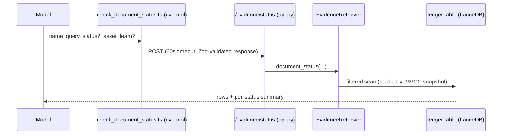

# Document Status Ledger Query Tool - Plan

## Goal Capsule

- **Objective:** Give the doc-intel agent a query surface over the evidence-store ingest ledger so absence and coverage claims are grounded in per-document status (complete / skipped / failed, with reasons) instead of memorized aggregate numbers.
- **Product authority:** Rob (scope confirmed 2026-07-11: full-status lookup, dedicated tool, absence-claim contract in instructions).
- **Stop conditions:** Surface rather than guess if the ledger read path behaves differently than `needs_ingest`'s terminality rule describes, or if adding the retrieval method requires store-schema changes (it must not — the ledger already carries everything).
- **Open blockers:** None.

---

## Product Contract

### Summary

A read-only ledger lookup: a new analysts-service endpoint queries the ingest ledger by key fragment and optional status/asset-team filters, a new eve tool (`check_document_status`) exposes it to the model, and the agent instructions make consulting it part of the absence-claim contract. The agent can then answer "does WellDrive have X?" with "yes, but it is a deferred Excel file" — citing the exact document — instead of reciting hedged aggregate counts.

### Problem Frame

The agent's evidence tools see only *indexed* documents. The ~5,100 deferred-format gate skips (spreadsheets, XML, email, ZIP) and any failed rows exist only in the ingest ledger, invisible to every tool. PR #15 patched instructions to hedge absence claims with memorized aggregate numbers ("could plausibly live in the ~5,100 deferred-format files"), and `corpus_overview` hard-codes those counts in its description — both stale the moment the corpus moves. The ledger's own design promise — "skips are queryable, never silent" (`references/evidence-store.md`) — has no query surface. This was explicitly deferred as follow-up work in PR #15.

### Requirements

Lookup behavior:
- R1. The agent can look up ingest status for WellDrive documents by case-insensitive contiguous key fragment, with optional `asset_team` and `status` filters, returning s3key, status, reason, page count, and updated-at per match.
- R2. `skipped` and `failed` are never merged: they are distinct statuses in rows and in the response's match-set summary, and each row carries a will-retry signal derived exactly as `needs_ingest` derives terminality: a row is settled only when its status is `complete` or `skipped` AND it carries a non-empty checksum; everything else re-runs. Terminality is relative to the bytes seen at the last pass — a changed upstream file re-ingests regardless.
- R3. An empty result is distinguishable from a skip — and is a weak answer, not a negative: the response makes "no ledger row" a different answer than "attempted and declined," carries the ledger's enumeration scope (full Westlake Resources tranche; 500-file corpus sample for other asset teams), and carries a freshness watermark (the ledger's latest updated-at) so absence claims can be scoped and dated rather than outrunning what the ledger ever saw.

Surface properties:
- R4. The endpoint is strictly read-only — no writes, no compaction, no `optimize()` — so it is safe to serve while an ingest pass runs (LanceDB MVCC).
- R5. The eve tool degrades like its siblings: service unreachable, non-OK status, and unexpected-shape responses each return `{ error }` with fallback guidance rather than throwing.
- R6. Live aggregates over hardcoded ones: the response includes a status summary computed from the matched set; neither the tool description nor instructions bake in corpus counts that will go stale.

Agent behavior:
- R7. The instructions make ledger consultation part of the absence-claim contract for Westlake content: before asserting a document does not exist or referring to deferred formats in the aggregate, the agent checks the ledger and cites specific documents when they exist.

### Acceptance Examples

- AE1. Given a MCCALLISTER clipboard-paste PNG key fragment, the tool returns status `skipped` with the unreadable-image reason and will-retry false — the agent can report "exists, terminally unreadable" rather than "not found."
- AE2. Given an Excel file's key fragment, the tool returns status `skipped` with the excel-family-deferred reason — the agent answers "exists in WellDrive but is a deferred format we don't index yet," citing the s3key.
- AE3. Given a fragment matching nothing in the ledger, the response says so explicitly, and the agent's answer distinguishes "never ingested / not in WellDrive at last pass" from "deliberately skipped."
- AE4. Asked "do we have a frac summary spreadsheet for well X?", the agent calls `check_document_status` (not just the indexed-search tools) and grounds its answer in the returned status.

### Scope Boundaries

- No ingestion of deferred formats — Excel ingest remains parked; this tool only makes the deferral visible.
- No change to ingest, skip, or retry semantics; no retry/reprocess controls on the endpoint.
- Not the "answer ledger" (`decisions/2026-07-07-context-layer-answer-ledger.md`) — that is a separate parked concept persisting verified agent answers; naming here stays on document/ingest status to avoid collision.

#### Deferred to Follow-Up Work

- Re-source `corpus_overview`'s hardcoded coverage counts from a live ledger aggregate endpoint — natural second consumer of this surface, separate change.

### Sources

- Deferral provenance: PR #15 ("skipped-ledger query surface deferred as follow-up"), instructions.md coverage self-model.
- Ledger semantics: `docs/solutions/logic-errors/ingest-ledger-conflates-parse-failures-with-skips.md`, `references/evidence-store.md` (schema, terminality, MVCC read safety), `CONCEPTS.md` (Ingest Ledger, Format Gate — canonical vocabulary for descriptions).
- Seam: `decisions/2026-07-05-doc-intel-seam.md` — endpoint on the Python analysts service; eve tool as thin typed HTTP client.

---

## Planning Contract

### Key Technical Decisions

- **KTD1. Endpoint on the existing evidence router, `POST /evidence/status`.** Add a `StatusRequest` pydantic model mirroring `FindRequest` (`name_query`, `asset_team`, `status`, `limit` with the same bounds) in `evidence/api.py`, calling a new `EvidenceRetriever` method through the cached `get_retriever()`. `/evidence/find` is the template; response is a plain dict like siblings.
- **KTD2. Query logic lives in `EvidenceRetriever`, reading the ledger via the store's table handle.** One scan with LIKE-style filtering on `s3key` (case-insensitive contiguous fragment, same semantics as `find_documents`), optional `status` equality and `asset_team` prefix filter. The ledger carries no `asset_team` column: the team filter is an `s3key` prefix match on `{team}/` (the archive layout `{asset_team}/{well}/…`), which is also why response rows carry no separate asset-team field. No new store schema; no latest-row logic needed — the ledger is delete-before-insert with one row per doc_id (`_write_ledger(delete_prior=True)`), and `doc_id` is a deterministic function of `s3key`.
- **KTD3. Will-retry is computed by mirroring `needs_ingest`, not re-derived.** A row reports `will_retry: true` iff `status == "failed"` OR its checksum is empty — the exact ledger-side mirror of `needs_ingest`'s settled test (status `complete`/`skipped` AND non-empty checksum). Neither status alone suffices: manifest-mode gate skips carry an empty checksum (no ETag) and re-run every pass, and `upsert_document`'s exception path writes `failed` rows WITH a checksum. The signal means "terminal for the bytes seen at the last pass" — a changed upstream file re-ingests regardless — and the tool description says so. Terminality logic must not fork from `store.needs_ingest` — that rule is the single source of truth (the conflation bug this ledger design fixed is documented in `docs/solutions/logic-errors/`).
- **KTD4. Response separates rows from summary and never sums skips with failures.** Shape: matched rows (s3key, doc_id, status, reason, will_retry, page_count, updated_at — no checksum, no vectors) plus a `summary` of counts keyed by status for the matched set, the total match count when it exceeds `limit`, and a `ledger_as_of` freshness watermark (the ledger's max updated-at — a cheap proxy for the last ingest pass) present on every response including empty ones. A summed "not indexed" number is structurally blind (the anchor learning); the split is a hard contract.
- **KTD5. Tool name `check_document_status`, dedicated file.** Verb-led like siblings (`find_`, `read_`, `search_`). Twelfth tool; follows `find_evidence_files.ts` verbatim: `DOC_INTEL_ANALYSTS_URL` env default, 60s `AbortSignal.timeout`, Zod `responseSchema` + `safeParse`, three-tier `{ error }` degradation. Description carries the contiguous-substring warning (the `name_query` trap documented on sibling tools), explains the three-way answer (indexed / declined-with-reason / no row), and states the enumeration scope: outside Westlake Resources the ledger only ever saw the corpus sample, so an empty result there says almost nothing about the full archive.

### Assumptions

- The ledger table at current scale (~38k rows) serves an unindexed filtered scan fast enough for a 60s tool timeout; `ledger_snapshot()` already full-scans it routinely during ingest resume. If Phase 2 migration moves `lance_root` to direct-S3, latency is re-measured there — the endpoint reads whatever `lance_root` points at and hardcodes no path.
- `status` filtering needs no validation beyond the three known values; unknown values simply match nothing.

---

## High-Level Technical Design

Request flow (mirrors the four existing `/evidence/*` tools):

Status classification the response encodes (the contract from the ledger design):

| Ledger state | Meaning | `will_retry` |
|---|---|---|
| `complete` + checksum | indexed; searchable via the other tools | false |
| `skipped` + checksum | deliberately declined (format gate, or deterministic image verdict); terminal for those exact bytes — a changed upstream file re-ingests | false |
| `failed` (any checksum) | fetch/parse error; re-attempted every pass | true |
| `skipped`/`complete`, empty checksum | verdict recorded without byte identity (e.g. manifest-mode skip, no ETag); re-evaluated every pass | true |
| no row | weak answer, not a negative: the fragment may be wrong, and outside Westlake the ledger only saw the corpus sample; otherwise never attempted at the last pass or landed since | n/a |

---

## Implementation Units

### U1. Ledger query method in the evidence package

- **Goal:** `EvidenceRetriever` gains a `document_status` query over the ledger with fragment/status/team filtering and the will-retry classification.
- **Requirements:** R1, R2, R3, R4.
- **Dependencies:** None.
- **Files:** `agents/doc-intel/analysts/src/doc_intel_analysts/evidence/retrieval.py`, `agents/doc-intel/analysts/tests/test_evidence_store.py`.
- **Approach:** Implement KTD2 and KTD3. Read via the store's `table("ledger")` handle with the same `.search().where(...).select([...])` chain `find_documents` uses; exclude checksum from returned rows; compute `will_retry` per KTD3 (status OR empty checksum); include the `ledger_as_of` watermark per KTD4. Return rows plus per-status counts for the match set.
- **Patterns to follow:** `find_documents` in `retrieval.py` (fragment semantics, limit handling); temp-store seeding via `run_ingest` with stubbed fetch in `test_evidence_store.py` (the established way to create complete/skipped/failed ledger rows in tests).
- **Test scenarios:**
  - Happy path: a seeded store with one complete, one gate-skipped (xlsx), and one failed row returns each with correct status and reason for a matching fragment.
  - Covers AE1/AE2 (classification contract): the skipped row reports `will_retry` false; the failed row reports `will_retry` true.
  - Parity contract (the hard gate): for every seeded row — including a skipped row seeded from manifest-mode entries WITHOUT ETags (empty checksum) — `document_status`'s `will_retry` agrees with what `store.needs_ingest` would decide for the same doc and checksum. This pins the mirror to the source of truth so the two cannot drift silently.
  - Covers AE3: a fragment matching no ledger rows returns an empty match set, zero counts, and a non-empty `ledger_as_of` watermark (not an error).
  - Filters: `status="skipped"` excludes complete/failed rows; `asset_team` filter scopes matches; limit truncates while the summary still reflects the full matched count.
  - Case-insensitivity: fragment matches regardless of case, mirroring `find_documents` semantics.
- **Verification:** `uv run pytest` green from `agents/doc-intel/analysts`.

### U2. `/evidence/status` endpoint

- **Goal:** The analysts service exposes U1 over HTTP on the evidence router.
- **Requirements:** R1, R4, R6.
- **Dependencies:** U1.
- **Files:** `agents/doc-intel/analysts/src/doc_intel_analysts/evidence/api.py`, `agents/doc-intel/analysts/tests/test_evidence_api.py`.
- **Approach:** Implement KTD1: `StatusRequest` model with `FindRequest`-style bounds, route body delegating to `get_retriever().document_status(...)`, response as plain dict. No error mapping beyond siblings' (nothing here raises `ValueError`).
- **Patterns to follow:** the `find` route in `api.py`; `FakeRetriever` + `TestClient` fixture in `test_evidence_api.py`.
- **Test scenarios:**
  - Happy path: request fields pass through to the retriever call intact (assert the recorded call tuple, `find`-endpoint style).
  - Edge: limit outside bounds is rejected by pydantic (422); missing `name_query` defaults to empty string, matching the `find` contract.
- **Verification:** `uv run pytest tests/test_evidence_api.py` green.

### U3. `check_document_status` eve tool

- **Goal:** The model can call the ledger lookup, with sibling-grade degradation.
- **Requirements:** R1, R5, R6.
- **Dependencies:** U2 (contract only — the tool tests stub fetch and need no live service).
- **Files:** `agents/doc-intel/agent/tools/check_document_status.ts`, `agents/doc-intel/tests/check_document_status.test.ts`.
- **Approach:** Implement KTD5, following `find_evidence_files.ts` verbatim (env var, timeout, Zod response schema, three-tier error handling). Description uses CONCEPTS.md vocabulary (Ingest Ledger, Format Gate), carries the contiguous-substring warning, explains the three-way answer, and embeds no corpus counts.
- **Patterns to follow:** `skills/adding-a-tool.md` checklist; `agents/doc-intel/tests/find_evidence_files.test.ts` (fetch stub with request-body capture, restore in afterEach).
- **Test scenarios:**
  - Happy path: stubbed response parses; result carries rows and summary; captured request body matches the input (undefined optionals dropped).
  - Error paths: fetch throws → `{ error }` naming the fallback; non-OK status → `{ error }` with the status code; wrong shape → `{ error }` about unexpected shape.
- **Verification:** `npx eve info` 0 diagnostics with the tool discovered; `pnpm typecheck && pnpm test`; `npx eve dev --no-ui` boot check.

### U4. Instructions: absence-claim contract

- **Goal:** The agent consults the ledger before making absence claims, and cites specific documents instead of aggregate counts.
- **Requirements:** R6, R7.
- **Dependencies:** U3.
- **Files:** `agents/doc-intel/agent/instructions.md`.
- **Approach:** Four touches, preserving the section's existing voice: (1) add `check_document_status` to the content-shaped-questions tool listing with its role; (2) rework the "coverage differs by leg" bullet so deferred-format coverage points at the tool rather than reciting "~5,100"; (3) rework the absence-claim bullet: for Westlake content, a negative answer requires an evidence-store search *and* a ledger check — "not indexed" claims name the skipped document and reason when one exists, absence claims are dated from the response's `ledger_as_of` watermark, an empty result requires fragment-variation retries before it counts as absence, and "not in WellDrive" conclusions are forbidden for non-Westlake teams (the ledger only saw their sample); (4) one line establishing that live `check_document_status` output is authoritative over `corpus_overview`'s static description counts when they conflict.
- **Test scenarios:** Test expectation: none — instructions-only unit; behavior is gated by U5.
- **Verification:** The three PR #15-era claims read consistently with the new tool; no stale aggregate count survives as the primary mechanism.

### U5. Eval: ledger-grounded absence answers

- **Goal:** Lock the new behavior in as a regression gate alongside `evidence-coverage`.
- **Requirements:** R7; Acceptance Example mechanics (AE2, AE4).
- **Dependencies:** U3, U4.
- **Files:** `agents/doc-intel/evals/ledger-status.eval.ts`.
- **Approach:** One eval in the `evidence-coverage.eval.ts` style, with a dynamic fixture: eval setup queries the running service's `/evidence/status` for a currently-skipped deferred-format row and asks about that document — so the gate survives deferred-format ingest un-parking without retargeting. Gate on `t.calledTool("check_document_status")`, an answer naming the deferred/skipped verdict, and no referral to "the full archive." Gates must fail closed (the twice-hardened lesson from the wildcat eval: affirmative assertions, not name-drops).
- **Patterns to follow:** `evals/evidence-coverage.eval.ts` (satisfies-negative gates, deferral carve-outs); one eval per file; `evals.config.ts` already exists.
- **Test scenarios:**
  - Covers AE2/AE4: agent calls the tool and reports "exists but deferred," naming the document.
  - Negative gate: the reply does not claim the document is absent from WellDrive.
- **Verification:** Passes live against the running analysts service with gateway creds (`npx eve eval ledger-status`); not part of the credential-free bar — record as pending if creds are absent at implementation time.

---

## Verification Contract

| Gate | Command | Applies to | Pass signal |
|---|---|---|---|
| Python suite | `uv run pytest` from `agents/doc-intel/analysts` | U1, U2 | All pass (125 pre-change + new) |
| Workspace bar | `pnpm typecheck && pnpm test` from repo root | U3 | Green |
| Discovery + boot | `npx eve info` then `npx eve dev --no-ui` from `agents/doc-intel` | U3, U4 | 0 diagnostics; server listening |
| Live eval | `npx eve eval ledger-status` with service + creds | U5 | All gates pass |

## Definition of Done

- U1–U5 landed; Python suite, workspace bar, and boot check green.
- Live eval passed, or explicitly recorded pending with the reason (creds/service unavailable).
- No summed skip+failure count anywhere in the new surface; no hardcoded corpus counts in the tool description or new instructions text. (`corpus_overview`'s existing static counts remain by design — re-sourcing them is the named deferred follow-up; the U4 instructions line makes the live tool authoritative on conflict.)
- No leftover experimental code from abandoned approaches in the diff.
- Work committed on a feature branch and pushed; PR opened per repo convention.
