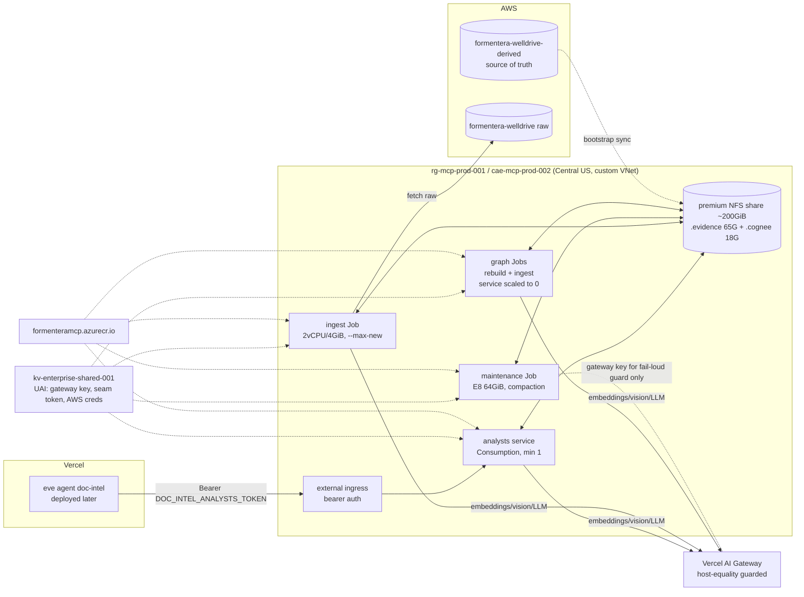
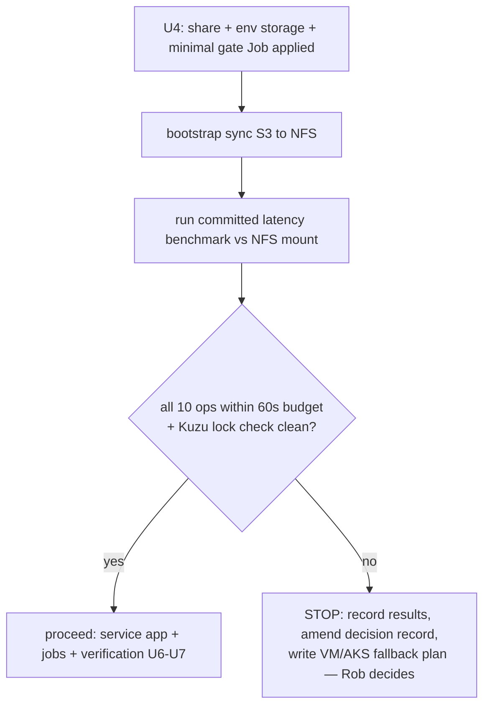

# Phase 4 Azure Evidence Hosting - Plan

## Goal Capsule

- **Objective:** Move the doc-intel evidence capability off the laptop: the analysts service (evidence legs + coexistence-phase graph leg + `/analyze`) runs as an Azure Container App with an NFS-mounted replica, and ingest/maintenance run as Container Apps Jobs — completing `decisions/2026-07-09-evidence-store-migration.md` and unblocking the eve production deploy.
- **Product authority:** Rob (scope confirmed 2026-07-12, including the reuse-not-rebuild environment posture and the evidence-capability framing from the company-brain direction).
- **Stop conditions:** U5's NFS gate is a hard go/no-go — if any of the 10 benchmark ops exceeds the 60 s tool budget on the NFS mount, STOP and surface; the fallback (VM/AKS + attached Premium SSD) is a separate plan, not an improvisation. Also stop if `cae-mcp-prod-002`'s subnet cannot take the NFS storage rules (NSG 445/2049, service endpoint) — environment choice is Rob's call at that point.
- **Open blockers:** none in-repo. Two owner dashboard prerequisites before U5/U6: create a static `AI_GATEWAY_API_KEY` on the Formentera team and land it in Key Vault; confirm team gateway credits + auto-reload (the known $0 mid-batch stall).
- **Revision (2026-07-13, Rob):** the IaC layer is **Bicep, not Terraform**. The org's lived Terraform practice is Snowflake infrastructure only, and ARM/Bicep keeps deployment state server-side — eliminating the secret-bearing `tfstate` and the remote-backend bootstrap the review flagged. All R2/U4 language below reads accordingly; identity, Key Vault reference, and no-secrets semantics are unchanged.

---

## Product Contract

### Summary

Containerize the analysts service and its batch tooling, stand the replica up on a premium Azure Files NFS share inside the existing `cae-mcp-prod-002` environment (custom VNet, workload-profiles), gate everything on an in-Azure re-run of the committed latency benchmark, close the seam's authentication gap, and wire ingest/maintenance/rebuild as Jobs — Bicep throughout (revised 2026-07-13; the `gis-snowflake-extractor` Terraform pattern informed the resource shapes, but the org's tf practice is Snowflake-only and ARM needs no client-side state).

### Problem Frame

The evidence store — the page-citation layer every verified answer depends on, including the company brain's own provenance gate — serves from a laptop that empirically cannot maintain it (three kernel panics, five jetsam kills; pages compaction needs >21 GB the machine doesn't have). The deployed eve agent cannot reach localhost, so every downstream milestone (deploy, Teams, Agent Runs) queues behind this hosting. Phases 1–3 are done: S3 is source of truth, the replica architecture is benchmark-chosen, team billing is live. Phase 4 is the build.

### Requirements

Infrastructure:
- R1. A premium (FileStorage/Premium_LRS) NFS share (~200 GiB provisioned — 65 GiB evidence + 18 GiB `.cognee` + growth; 3,200 baseline IOPS at that size) is mounted into the service and jobs via an environment storage definition on `cae-mcp-prod-002`, whose subnet NSG allows ports 445/2049 and whose VNet can reach the storage account.
- R2. All Azure resources are Bicep-managed (deployed via `az deployment group`; state lives server-side in ARM — no state files): user-assigned identity with `Key Vault Secrets User` on `kv-enterprise-shared-001`, images in `formenteramcp.azurecr.io` pulled by managed identity, secrets as Key Vault references — no literal secrets in templates or env blocks.
- R3. The environment gains a Dedicated **E8** workload profile (64 GiB) for the maintenance job — pages compaction OOMs at 21–24 GB and the ACA runtime reserves headroom, so E4's 32 GiB is too tight. Mechanism: the shared environment is not owned by this stack (declaring it in IaC would mean owning its full definition), so the profile is added via a documented `az containerapp env workload-profile add` step owned by U4's runbook (check `az containerapp env show` first — if a Dedicated profile already exists, the marginal management fee is zero). A standing Dedicated profile triggers a per-environment management fee independent of replicas; if material, the documented alternative is adding/removing the profile around maintenance runs.

The gate:
- R4. Before anything builds on the mount, the committed latency benchmark re-runs inside Azure against the NFS replica: all 10 ops must land within the 60 s tool budget (target: near the local-NVMe column — worst warm op 4.0 s; baseline table in `benchmark/results/2026-07-11-phase2-s3-latency.json`). Failure triggers the documented VM/AKS fallback as a separate plan.

Service:
- R5. The analysts service runs as a Container App (Consumption profile, min 1 replica) from an image that bundles the repo-root assets its path resolution needs (`references/`, `corpus/sample-manifest.csv`; `.masters/` is gitignored laptop state and rides the share instead, keeping the image buildable from a clean checkout), prefetches OpenCLIP weights at build (`prefetch_clip_weights()`; CPU inference), and mounts the share's subdirectories at `analysts/.evidence`, `analysts/.cognee`, and `analysts/.masters` (the evidence roots have no env hook — the mount points are the contract).
- R6. The seam gains bearer authentication on both sides: the service rejects unauthenticated requests when `ANALYSTS_API_TOKEN` is set (health endpoint exempt; unset = local dev unchanged), and every eve tool that calls `DOC_INTEL_ANALYSTS_URL` sends the token from env. Ingress is external + IP-unrestricted only insofar as bearer auth carries the boundary (Vercel functions cannot join the VNet). Hosted mode fails closed: Terraform pins non-secret `ANALYSTS_REQUIRE_AUTH=1` and the service refuses to start when that is set and the token is missing, so env drift can never silently serve the corpus open. TLS carries the token: `allow_insecure_connections = false` is pinned and `DOC_INTEL_ANALYSTS_URL` must be `https://`.
- R7. The hosted service authenticates to the AI Gateway with a static team-scope `AI_GATEWAY_API_KEY` from Key Vault — no OIDC token refresh machinery. The egress guards (host-equality on `ai-gateway.vercel.sh`, telemetry off, the full silent-egress env set from `graph/config.py`) are baked into the container env and fail loud on drift.

Jobs and operations:
- R8. Three steady-state job shapes on the shared mount — evidence ingest (batch `--max-new` discipline, manual first then cron-able), maintenance (full `--maintain` incl. pages compaction, E8 profile, manual trigger), and graph work (ontology rebuild + graph ingest, gated: the service holds Kuzu's process lock, so graph jobs run with the service scaled to zero, and the rebuild carries a Human Gate on gateway cost) — plus a one-off **gate job** (wave 1: bootstrap sync, benchmark, Kuzu/NFS checks) that U4 owns in Terraform like the others, with its own env spec.
- R9. The replica bootstrap is the Phase 1 sync reversed (S3→mount), implemented in `replica.py` with boto3 (already a dependency — the image carries no AWS CLI) and committed as tooling. Scope covers `lance/` + `parsed/` **plus the `.cognee` store snapshot and `.masters/` inputs**, which requires a one-time laptop→S3 upload extending the Phase 1 sync before the gate runs — also the first execution of the `.cognee` durability habit the brain decision requires, and what makes U6's graph-backed evals runnable before U7's rebuild. S3 remains source of truth and the replica stays disposable.
- R10. Azure viewership joins the trace invariant: principals with access to the container, mount, logs, **or any secret that grants seam access** (`ANALYSTS_API_TOKEN` in Key Vault and Vercel env) remain a subset of raw-archive S3 readers (`decisions/2026-07-11-agent-runs-trace-retention.md` extended to the new locus). Enforced, not just documented: U4 produces a one-time RBAC enumeration (`az role assignment list` over the resource group, Log Analytics workspace, storage account, and vault secret) compared against the S3 raw-reader list, committed as gate evidence, with a runbook line to re-run it on membership change.
- R11. Hosted verification: the full local eval suite passes against the ACA URL from the dev eve agent, and the Vercel env values for the eventual deploy (`DOC_INTEL_ANALYSTS_URL`, `DOC_INTEL_ANALYSTS_TOKEN` — same secret value as the service-side `ANALYSTS_API_TOKEN`, AWS read creds, `BRAIN_MCP_TOKEN`) are staged/documented — the deploy itself is out of scope.

### Acceptance Examples

- AE1. The NFS gate table shows all 10 ops within budget, committed to `benchmark/results/`, and the migration decision record gains its Phase 4 gate note.
- AE2. `npx eve eval` (all evals incl. `ledger-status` and the brain trio) passes with `DOC_INTEL_ANALYSTS_URL` pointed at the ACA ingress and the bearer token set.
- AE3. The maintenance job completes pages compaction on E8 without OOM; fragment count drops from 12,851 to double digits, and a follow-up grep benchmark shows the scan-latency win.
- AE4. A request to `/analyze` without the bearer token returns 401 while `/health` stays 200; the same request with the token succeeds.

### Scope Boundaries

- No eve production deploy, Teams channel, Agent Runs consumption, or claims-contract work — downstream milestones.
- No company-brain repo changes; the graph leg rides along per the coexistence phase of `decisions/2026-07-12-company-brain-shared-recall.md`.
- No new ACA environment unless `cae-mcp-prod-002` proves unusable (stop condition, Rob's call).
- Laptop serving remains available as fallback until U6 verification passes; nothing is decommissioned in this plan.

#### Deferred to Follow-Up Work

- Cron-scheduling the ingest job against WellDrive change detection (the readiness-radar roadmap item); first runs are manual.
- Direct-S3 re-test post-compaction from inside Azure (cheap curiosity, nothing depends on it).
- The VM/AKS fallback plan — written only if the U5 gate fails.

### Sources

- Decision spine: `decisions/2026-07-09-evidence-store-migration.md` (phases, NFS resolution, gate contract, fallback), `decisions/2026-07-12-company-brain-shared-recall.md` (coexistence obligations), `decisions/2026-07-11-agent-runs-trace-retention.md` (viewership invariant).
- Live discovery (2026-07-12, az CLI): brain env `cae-fmtr-brain-001` disqualified (no VNet, Consumption-only); target env `cae-mcp-prod-002` (Central US, `rg-mcp-prod-001`) has custom VNet + workload profiles; registry `formenteramcp.azurecr.io` in the same RG; `kv-enterprise-shared-001` in `rg-enterprise-shared-001`.
- Terraform convention: `gis-snowflake-extractor/terraform/container_app_job.tf` + its `Dockerfile` (python:3.12-slim + uv, non-root) — the sibling-repo pattern to copy.
- ACA facts (Microsoft Learn, primary): Dedicated profiles D/E-series (E8 = 64 GiB); Jobs support cron + workload profiles + `NfsAzureFile` mounts, `replicaTimeout` configurable with no documented ceiling; NFS requires custom-VNet env + NSG 445/2049 + account-key storage definition; premium share perf = `3000 + 1×GiB` baseline IOPS; ACR pull by managed identity; default egress reaches S3.
- Runtime contract: `evidence/config.py` (roots package-relative, no env hook; egress guard), `graph/config.py` (the silent-egress env set: `LLM_ENDPOINT`/`EMBEDDING_ENDPOINT`/`TELEMETRY_DISABLED`/`CACHING=false`/bare embedding ids/`LLM_INSTRUCTOR_MODE=tool_call`), `evidence/store.py` (CLIP prefetch), batch CLIs and their repo-root path resolution (`parents[5]`/`parents[6]`), store sizes (`.evidence` 65 G — pages.lance 55 G; `.cognee` 18 G; `.masters` real dir).
- Gate baseline: `benchmark/results/2026-07-11-phase2-s3-latency.json` (local all-green, worst warm 3.995 s; direct-S3 6/10 timeouts). The runner exists only in session scratch — U1 commits it.
- Seam auth gap: `delegate_analysis.ts` (no auth header) + `service.py` (no auth dependency) — verified 2026-07-12.

---

## Planning Contract

### Key Technical Decisions

- **KTD1. Reuse `cae-mcp-prod-002`, not the brain's env and not a new one.** The brain's `cae-fmtr-brain-001` has no custom VNet (creation-time property) so it cannot mount NFS; `cae-mcp-prod-002` has the VNet and is a workload-profiles environment, so it can take both the storage definition and an added E8 profile. Implementation-time confirmations: subnet has room (≥/27 semantics already satisfied — it exists), NSG rules, storage-account network access from that VNet.
- **KTD2. One image, two modes.** A single container image (sibling Dockerfile pattern: `python:3.12-slim`, uv sync from the committed `uv.lock`, non-root, `--platform=linux/amd64`) serves both the always-on service (uvicorn entrypoint) and every job (module entrypoints as args) — the batch CLIs already share the package. Build context is the repo root so `references/` and `corpus/sample-manifest.csv` land in the image at the relative depths `parents[5]`/`parents[6]` resolution expects (`.masters/` is gitignored laptop state — it rides the share per KTD3, never the image); `.dockerignore` excludes `.venv`, `.evidence`, `.cognee`, `.masters`, `node_modules`, `.eve`. CLIP weights prefetch at build so steady-state inference is offline (CPU on Linux).
- **KTD3. The mount is the storage contract — one share, three subdirectories, `sub_path` mounts.** Evidence roots are package-relative with no env override, so the share carries `evidence/`, `cognee/`, and `masters/` subdirectories mounted via `sub_path` at `analysts/.evidence`, `analysts/.cognee`, and `analysts/.masters` respectively (azurerm supports `sub_path` on `NfsAzureFile` mounts for both apps and jobs — never mount the share root at both store paths: that makes `.evidence` and `.cognee` the same directory, and graph rebuilds wipe `.cognee`, which would destroy the evidence store). `.cognee` is 18 GiB — far over the 8 GiB ephemeral cap, and its loss costs a ~$95 rebuild. The U5 gate includes the Kuzu-on-NFS locking sanity check the brain decision requires (open the graph store on the mount, exercise service reads, confirm the process lock behaves) plus a write check as the non-root container user (NFS ownership is real POSIX; ACA has no fsGroup).
- **KTD4. Bearer auth, symmetric and dev-transparent.** Service: a FastAPI dependency reads `ANALYSTS_API_TOKEN`; when unset, auth is disabled (local dev and tests unchanged); when set, all routes except `/health` require `Authorization: Bearer`. eve side: one shared helper in `agent/lib/` builds headers from `DOC_INTEL_ANALYSTS_TOKEN`, adopted by all analyst-calling tools. Token minted per environment (≥32 bytes from a CSPRNG, e.g. `openssl rand -base64 32`), stored in Key Vault, surfaced to the Container App as a secret and to Vercel env at deploy time. The auth dependency never logs the presented token or header, including on mismatch; rotation lives in the U7 runbook (new KV secret version → Vercel env → revision restart, brief 401 window accepted).
- **KTD5. Static gateway key kills OIDC babysitting.** The container env carries `AI_GATEWAY_API_KEY` (team scope, from Key Vault) — both guards accept it and no 12-hour refresh loop exists in Azure. The full silent-egress env set is pinned in the IaC env blocks (values are non-secret except the keys), so the guard-validated configuration is versioned infrastructure, not tribal knowledge.
- **KTD6. Jobs follow the sibling convention, sized by evidence.** One Container Apps Job resource per shape: ingest (Consumption, 4 GiB — per-doc parsing peaked well under that with `--max-new` discipline... sized 2 vCPU/4 GiB, `--max-new 250` args), maintenance (E8 profile, replica timeout generous — compaction measured hours locally), graph rebuild (Consumption; cost gate is dollars not memory). Graph jobs pair with scaling the service to zero (Kuzu single-writer process lock) — encoded in the runbook and the job's own preflight check, not left to memory. Every job shape carries the full guard-validated env **including the gateway key** — `load_config()` fails loud without it even for jobs that never egress (maintenance) — plus per-shape secrets: the gate and ingest jobs also carry the AWS read credentials (bootstrap sync / raw fetch); maintenance and graph jobs need no AWS creds.
- **KTD7. The gate benchmark becomes repo tooling.** U1 ports the session-scratch runner into the package (read-only store shim — never `EvidenceStore.__init__` against a root it shouldn't create tables in; stored-vector query embedding; 90 s caps; JSON output) parameterized by lance root, so the same tool produced the S3 baseline, produces the NFS verdict, and can re-test direct-S3 post-compaction.

### Assumptions

- `cae-mcp-prod-002`'s VNet/subnet accepts the storage service endpoint and NSG additions without conflicting with existing MCP apps (checked at U4; stop condition if not).
- Bicep needs no state arrangement — ARM deployment history is the record; `what-if` against the live resource group is the pre-apply review.
- Cross-cloud bootstrap (~83 GiB S3→NFS incl. the `.cognee` snapshot and masters) runs minutes-not-hours from Central US and costs ~$8 egress per full sync — startup-time cost only, per the accepted trade-off.
- Rough steady-state cost: ~$30–45/mo premium share (200 GiB) + ~$40–60/mo always-on Consumption service + E8 node-hours while maintenance runs (~$0.75/hr) + the Dedicated-plan per-environment management fee a standing E8 profile triggers (tens of $/mo — zero marginal if `cae-mcp-prod-002` already has a Dedicated profile; check at U4, or run the profile transiently per R3) + ACR/log trivia ≈ **$80–160/mo**; acceptable against the laptop-crash alternative (flag to Rob at U4 apply — a Human Gate in spirit).

---

## High-Level Technical Design

Gate sequencing (U5 is the hinge):

---

## Implementation Units

### U1. Commit the latency benchmark as repo tooling

- **Goal:** The Phase 2 runner becomes `doc_intel_analysts.evidence.latency_bench` — parameterized roots, same 10 ops, JSON results — so the NFS gate runs the identical instrument that produced the baseline.
- **Requirements:** R4; KTD7.
- **Dependencies:** none.
- **Files:** `agents/doc-intel/analysts/src/doc_intel_analysts/evidence/latency_bench.py`, `agents/doc-intel/analysts/tests/test_latency_bench.py`.
- **Approach:** Port the scratchpad runner (read-only `lancedb.connect` + `open_table` shim; `EvidenceRetriever` with a stored-vector query embedder; per-op 90 s caps via abandoned futures; cold + warm medians; `os._exit` to dodge stuck-thread joins). CLI: `--root <uri>` (repeatable for A/B), `--out <json>`. Never instantiate `EvidenceStore` against an arbitrary root (its `__init__` creates missing tables).
- **Patterns to follow:** `evidence/benchmark.py`'s CLI shape; the archived results schema in `benchmark/results/2026-07-11-phase2-s3-latency.json`.
- **Test scenarios:**
  - Happy path: against a `make_store` temp root, the runner produces all 10 op rows with numeric cold/warm values and the budget flag.
  - Edge: an op exceeding a (test-lowered) cap records the timeout sentinel instead of hanging the run.
- **Verification:** `uv run pytest tests/test_latency_bench.py`; a local run against the laptop store reproduces the baseline column within noise.

### U2. Container image

- **Goal:** One linux/amd64 image serving both uvicorn and batch-module entrypoints, with CLIP weights baked and repo-root assets at the expected relative depths.
- **Requirements:** R5; KTD2.
- **Dependencies:** none (parallel with U1).
- **Files:** `agents/doc-intel/analysts/Dockerfile`, `.dockerignore` (repo root), `agents/doc-intel/analysts/docker-entrypoint.sh` (or CMD-arg convention documented in the Dockerfile).
- **Approach:** Copy the `gis-snowflake-extractor` Dockerfile skeleton (python:3.12-slim, uv from the official image, `uv sync --no-dev` against the committed lock, non-root user). Build from repo-root context; COPY the package plus `references/` and `corpus/sample-manifest.csv` — **not** `.masters/` (gitignored laptop state; it rides the share per KTD3, so the image builds from a clean checkout). Install editable at full repo depth and never `--no-editable` — the roots' `parents[3]` resolution depends on the source-tree layout, and a site-packages install would silently relocate the store to an empty directory. The CLIP prefetch must satisfy the config guard at build time: `RUN AI_GATEWAY_API_KEY=build-placeholder python -c "from doc_intel_analysts.evidence.config import prefetch_clip_weights; prefetch_clip_weights()"` (placeholder scoped to the RUN line; it never persists in the image env). Default CMD runs uvicorn on 8734; jobs override with `python -m doc_intel_analysts.evidence.ingest ...` style args. Mount points `analysts/.evidence`, `analysts/.cognee`, and `analysts/.masters` exist empty (the volumes cover them).
- **Patterns to follow:** sibling Dockerfile; the egress-guard env contract (bake nothing that contradicts it — env comes from Terraform).
- **Test scenarios:**
  - Happy path: `docker build` succeeds; `docker run` with a temp-store volume and a dummy gateway key serves `/health` 200.
  - Error path: container without any gateway credential fails loud at first store/graph init (the guard), not silently.
- **Verification:** local build + the two runs above; image pushed to `formenteramcp.azurecr.io/doc-intel-analysts:<tag>` (push may ride U4's apply if ACR perms need the UAI).

### U3. Seam bearer authentication

- **Goal:** The `/analyze`, `/evidence/*`, `/graph/*` surface requires a bearer token when configured, and every eve tool sends it — closing the verified no-auth gap before the service is network-reachable.
- **Requirements:** R6; AE4; KTD4.
- **Dependencies:** none (parallel).
- **Files:** `agents/doc-intel/analysts/src/doc_intel_analysts/service.py`, `agents/doc-intel/analysts/tests/test_service_auth.py`, `agents/doc-intel/agent/lib/analysts.ts` (new shared helper), the seven analyst-calling tools in `agents/doc-intel/agent/tools/` (`search_evidence`, `grep_evidence`, `find_evidence_files`, `read_evidence`, `check_document_status`, `delegate_analysis`, `query_knowledge_graph`), their tests in `agents/doc-intel/tests/`.
- **Approach:** Service auth with three hosted-mode properties: (1) when `ANALYSTS_API_TOKEN` is set, all routes except `/health` require `Authorization: Bearer <token>` — constant-time compare, 401 on mismatch, and the auth path never logs the presented credential; (2) FastAPI's auto-mounted `/docs`, `/redoc`, and `/openapi.json` routes bypass app-level dependencies, so when the token is set the app is constructed with `docs_url=None, redoc_url=None, openapi_url=None` (or auth moves to ASGI middleware, which covers everything); (3) fail-closed startup — when `ANALYSTS_REQUIRE_AUTH=1` (Terraform-pinned, non-secret) and the token is missing, the service refuses to start. TS: `analystHeaders()` in `agent/lib/analysts.ts` returns content-type + optional Authorization from `DOC_INTEL_ANALYSTS_TOKEN`; tools adopt it (also centralizes `ANALYSTS_URL` — currently duplicated per tool).
- **Patterns to follow:** the tools' existing three-tier error handling (a 401 surfaces as the `Evidence service responded 401.` branch — acceptable); `#*` import alias for the lib.
- **Test scenarios:**
  - Service: token set + correct header → 200; token set + missing/wrong header → 401; token unset → open (existing tests keep passing untouched); `/health` always 200; token set → `/openapi.json` and `/docs` not reachable; 401 responses and log output contain no token material; `ANALYSTS_REQUIRE_AUTH=1` with no token → startup refuses.
  - Tools: fetch stub asserts the Authorization header present when `DOC_INTEL_ANALYSTS_TOKEN` is set and absent when not (one representative tool test extended; others inherit via the helper's own unit test).
- **Verification:** `uv run pytest` + `pnpm typecheck && pnpm test` + boot check; live eval suite still green against the local (tokenless) service.

### U4. IaC stack (Bicep — revised 2026-07-13 from Terraform)

- **Goal:** The whole Azure footprint as code: storage, environment storage definition, E8 profile, the service app, the job shapes, identity/KV/ACR wiring.
- **Requirements:** R1, R2, R3, R7, R8 (job definitions), R10 (principals note in module README); KTD1, KTD5, KTD6.
- **Dependencies:** U2 (image reference), U3 (token secret shape).
- **Files:** `agents/doc-intel/analysts/infra/{main.bicep, modules as scoping requires, main.bicepparam, README.md}` (originally authored as a Terraform stack, converted 1:1 after the owner's IaC revision).
- **Approach:** Mirror the sibling convention's semantics in Bicep: UAI + `Key Vault Secrets User` on `kv-enterprise-shared-001` (cross-RG role assignment via a module scoped to `rg-enterprise-shared-001`); registry pulls by the UAI. No client-side state exists — ARM deployment history is the record and `az deployment group what-if` is the pre-apply review. New resources: storage account (FileStorage, Premium_LRS, VNet-scoped network rules) + 200 GiB NFS share + the environment-storage child resource (NFS) referenced onto the existing `cae-mcp-prod-002`; the E8 workload profile lands via the documented `az` CLI step (R3 — the environment is not owned by this stack); NSG rules 445/2049 as additive child rules on the existing NSG. Service app: Consumption profile, min/max 1 replica, external ingress 8734 with insecure connections disallowed, the three `sub_path` mounts (KTD3), env = the full guard-validated set + `ANALYSTS_REQUIRE_AUTH=1` + secrets (`AI_GATEWAY_API_KEY`, `ANALYSTS_API_TOKEN`, AWS read creds) as Key Vault references. Jobs, each with its per-shape env per KTD6: gate (one-off — bootstrap/benchmark/Kuzu checks; wave 1), ingest (manual trigger first; cron authored but disabled), maintenance (E8, replica timeout ≥ 6 h), graph-rebuild (manual, with the service-scaled-to-zero preflight documented in README and encoded as a job init check where practical). The two-wave split is realized by a `deployService` parameter gating the service app + steady-state jobs. U4 also produces the R10 RBAC enumeration (role assignments over the RG, workspace, storage account, and vault secret vs the S3 raw-reader list), committed as gate evidence.
- **Patterns to follow:** `gis-snowflake-extractor/terraform/container_app_job.tf` for resource semantics (identity, KV references, job shapes) — expressed in Bicep.
- **Test scenarios:** Test expectation: none — infrastructure code; `az bicep build` (compile + lint) and a reviewed `what-if` are the check, and U5/U6 are the behavioral proof.
- **Verification:** `az bicep build` clean; `az deployment group what-if` reviewed against the real resource group (read-only until Rob nods at the cost line); wave-1 deploy (storage + gate job) first, full deploy after the gate passes.
- **Execution note:** apply in two waves — storage/env/profile + a one-off gate Job first; service + remaining jobs only after U5 goes green.

### U5. Replica bootstrap and the NFS gate

- **Goal:** The share holds a verified replica; the committed benchmark and the Kuzu locking check pass inside Azure — or the plan stops.
- **Requirements:** R4, R9; KTD3, KTD7; AE1. **This unit is the stop condition.**
- **Dependencies:** U1, U2, U4 (storage slice).
- **Files:** `agents/doc-intel/analysts/src/doc_intel_analysts/evidence/replica.py` (boto3-based sync CLI — paginated, idempotent by size/etag skip so re-runs resume; down-sync for `lance/` + `parsed/` + the `.cognee` snapshot + `.masters/`, count/byte verification mirroring the Phase 1 script), `agents/doc-intel/analysts/tests/test_replica.py`, results committed to `benchmark/results/2026-07-12-phase4-nfs-gate.json`, decision-record amendment in `decisions/2026-07-09-evidence-store-migration.md`.
- **Approach:** Pre-step (laptop, once): extend the Phase 1 upload to push the `.cognee` snapshot and `.masters/` to S3 so the bootstrap has a complete source. Run the bootstrap as the one-off gate Job (image from U2, args `python -m doc_intel_analysts.evidence.replica --bootstrap`); then the benchmark Job (`python -m doc_intel_analysts.evidence.latency_bench --root /path/to/mounted/lance --out ...`); then the Kuzu check (open the synced `.cognee` store on the mount from one process, confirm lock acquisition/release semantics and a basic read) and the non-root NFS write check (KTD3) — both scripted into the gate job. Pull the results JSON, compare against the baseline table, commit + amend the decision record either way.
- **Patterns to follow:** the Phase 1 sync script's verify step (count + bytes parity); the Phase 2 results schema.
- **Test scenarios:**
  - Happy path (unit-level, local): the dry-run flag prints the sync plan; skip logic leaves an up-to-date local file untouched (temp-dir fake, stubbed client, no network — keep it thin; the real proof is the gate run itself).
  - Covers AE1: gate results all within budget → recorded; any op over 60 s → STOP path exercised (documented, decision amended, fallback plan queued).
- **Verification:** gate JSON committed; decision record updated; go/no-go explicitly stated to Rob before U6 proceeds.

### U6. Hosted verification and cutover staging

- **Goal:** The hosted service is proven equivalent from the eve agent's seat; deploy-time env is staged; the laptop remains fallback.
- **Requirements:** R11; AE2.
- **Dependencies:** U3, U4 (full apply), U5 (green).
- **Files:** `agents/doc-intel/README.md` (hosted-service section: URL, token env names, Vercel env staging table), `agents/doc-intel/analysts/terraform/outputs.tf` (ingress URL output).
- **Approach:** Point local dev at the ACA URL (`DOC_INTEL_ANALYSTS_URL` + `DOC_INTEL_ANALYSTS_TOKEN` in the agent's local env), run the full eval suite live (all seven: delegation, evidence-coverage, graph-explore, both tandems, ledger-status, brain trio — creds required; the graph-backed evals work because R9's bootstrap synced the `.cognee` snapshot, not because of U7's rebuild), spot-check 3–5 benchmark questions manually. Document the Vercel-env staging table (names, KV sources, which are secrets) without deploying.
- **Test scenarios:**
  - Covers AE2: full eval suite green against the hosted URL.
  - Error path: with a wrong token, tools surface the 401 degradation branch and the agent reports the service unreachable-style fallback (manual spot-check).
- **Verification:** eval output recorded; README section merged; Rob confirms latency feels acceptable in a live TUI session (the human smoke test).

### U7. Operations: runbooks and the deferred heavy jobs

- **Goal:** The three parked heavyweights finally run in their proper home, and operating knowledge is committed, not tribal.
- **Requirements:** R8; AE3.
- **Dependencies:** U5, U6.
- **Files:** `agents/doc-intel/analysts/terraform/README.md` (runbook: job triggers, sequencing rules, cost gates), `references/evidence-store.md` (hosted-operations paragraph replacing laptop-era caveats), decision-record close-out note.
- **Approach:** Execute in order: (1) maintenance job → pages compaction on E8 (AE3: fragments 12,851 → double digits; re-run the grep ops from the benchmark to record the win); (2) ontology rebuild job with the Human Gate on cost (banked 490 individuals; expected validation ≈ ceiling per the enrichment decision) — service scaled to zero first, snapshot `.cognee` to S3 after (the durability habit the brain decision requires until migration); (3) evidence ingest job dry-run against a small prefix to prove the raw-fetch path. The runbook also carries: the secret-rotation path (new KV secret version → Vercel env → revision restart; brief 401 window), the masters-update path (edit on laptop → re-upload to S3 → re-run the bootstrap sync for `masters/` — the image never bakes them), the R10 re-check trigger on membership change, and the E8 profile add/remove step if running it transiently (R3). Update `references/evidence-store.md`: compaction is no longer blocked, token babysitting is dead, the store's home is the mount.
- **Test scenarios:** Test expectation: none — operational execution verified by AE3's measured outcomes and the recorded runbook.
- **Verification:** compaction metrics + rebuild ledger committed to `benchmark/results/`/run notes; `docs/solutions`-grade learnings captured if anything surprises.

---

## System-Wide Impact

- **Shared-environment blast radius.** `cae-mcp-prod-002` hosts existing production MCP apps. The additions are all non-disruptive shapes — a new workload profile is additive, the storage definition is env-scoped metadata, and NSG changes are new *allow* rules only (no existing rule is modified) — but the subnet's NSG and the VNet's service endpoints are shared state: U4's `what-if` output must be reviewed against the existing apps' rules before deploying, and any conflict is the KTD1 stop condition, not something to force.
- **Seam-auth sequencing.** Seven eve tools and the service share the bearer contract. Deploy order matters once the service is hosted: ship the tool-side helper (which sends the header only when the token env is set) *before* enabling `ANALYSTS_API_TOKEN` on the service — the reverse order breaks every tool at once. Locally nothing changes: token unset = auth disabled, existing tests and the running laptop service untouched until cutover.
- **Single-writer cutover discipline.** LanceDB tolerates one writer. Today the laptop is the writer and syncs up to S3; the moment the first Azure ingest/maintenance job writes the NFS replica, **laptop ingest and maintenance stop permanently** — two writers reconciling through S3 sync would silently drop or corrupt table state. The cutover point is U7's first job run; the runbook states it, and the laptop's remaining role is read-only serving fallback until U6 passes, then none. The same discipline holds inside Azure: jobs never run concurrently with each other (service reads stay MVCC-safe throughout).
- **Kuzu process lock crosses the service/job boundary.** Graph jobs and the service contend on one embedded store; the sequencing (scale service to 0 → run graph job → snapshot `.cognee` to S3 → scale up) is a system invariant, not a job detail — encoded in U4's runbook and U7's execution order.
- **Trace/viewership invariant extends to Azure.** Container logs, the NFS mount, and `az containerapp exec` access now expose corpus-derived text; the principals of `rg-mcp-prod-001` join the audit scope of `decisions/2026-07-11-agent-runs-trace-retention.md` (R10).
- **Downstream consumers unchanged.** The eve agent's tool surface, the eval suite, and the brain connection are untouched by hosting; only `DOC_INTEL_ANALYSTS_URL` (+ token) changes at cutover, staged in U6.

## Risks & Dependencies

| Risk | Likelihood / impact | Mitigation |
|---|---|---|
| NFS latency fails the gate | Unknown / high | U5 is a hard go/no-go against the committed baseline; documented VM/AKS + Premium SSD fallback becomes its own plan — no improvisation on a failed gate |
| Kuzu embedded-DB behavior on NFS (locking, mmap) misbehaves | Unknown / medium | Explicit lock check inside the U5 gate; `.cognee` S3 snapshot after every graph job (loss = ~$95 rebuild, not data loss) |
| Image size (torch + CLIP weights, multi-GB) slows starts | Likely / low | Service runs min 1 replica (no steady-state cold starts); jobs tolerate pull time; ACR is in-region |
| Bootstrap sync fails mid-transfer (~83 GiB cross-cloud) | Possible / low | `replica.py`'s boto3 sync skips already-transferred objects by size/etag, so re-runs resume; U5 verifies counts + bytes before the gate runs |
| E8 profile carries a standing Dedicated management fee | Likely / low | Zero marginal if the env already has a Dedicated profile (check at U4); otherwise accept it in the cost line or add/remove the profile around maintenance runs via the R3 CLI step |
| Gateway credits exhaust mid-batch (known $0 stall mode) | Possible / medium | Owner prerequisite: auto-reload confirmed before U7's rebuild; jobs fail loud and resume via ledger idempotency |
| Subnet/NSG conflict with existing MCP apps | Possible / high | Read-only `what-if` review + KTD1 stop condition; Rob decides env strategy if it fires |
| Two-writer corruption during transition | Low / critical | Single-writer cutover rule above; runbook states the laptop stop-write point explicitly |

**Owner dependencies (Rob, dashboard, before U5–U7):** mint the team-scope `AI_GATEWAY_API_KEY` and land it in `kv-enterprise-shared-001`; place `ANALYSTS_API_TOKEN` and the AWS read-only keys in the same vault; confirm team gateway credits + auto-reload; confirm ACR push rights for the image (or grant them to the UAI). Everything else is executable from this repo with existing `az`/`terraform` access.

## Verification Contract

| Gate | Command / evidence | Applies to | Pass signal |
|---|---|---|---|
| Python suite | `uv run pytest` from `agents/doc-intel/analysts` | U1, U3, U5 | all pass (132 pre-change + new) |
| Workspace bar | `pnpm typecheck && pnpm test` from repo root | U3 | green |
| Boot + discovery | `npx eve info` / `npx eve dev --no-ui` | U3 | 0 diagnostics; serves |
| Image | `docker build` + `/health` smoke + guard fail-loud run | U2 | both behaviors observed |
| IaC | `az bicep build` + reviewed `what-if` | U4 | clean build; Rob nod on cost |
| **NFS gate** | `latency_bench` vs mount, in-Azure | U5 | **all 10 ops ≤ 60 s** + Kuzu check clean |
| Hosted evals | full `npx eve eval` vs ACA URL | U6 | all pass |
| Compaction | maintenance job run + fragment count | U7 | completes on E8; fragments ↓ to double digits |

## Definition of Done

- U1–U7 landed; every gate above green or the U5 stop condition formally taken (results committed, decision amended, fallback plan queued — that outcome is also "done" for this plan's gate unit).
- The service answers the full eval suite from the ACA URL with bearer auth on; the laptop is no longer load-bearing — serving fallback only until U6 passes, and not a fallback at all once U7's first Azure write lands (single-writer rule).
- Pages compaction and the ontology rebuild have run in Azure; their results are committed.
- No secrets in the repo or IaC templates; the silent-egress env set is IaC-pinned; Azure principals noted against the viewership invariant.
- No leftover experimental code from abandoned approaches in the diff.
- Work lands as reviewable PRs per repo convention; the migration decision record carries the Phase 4 close-out.
